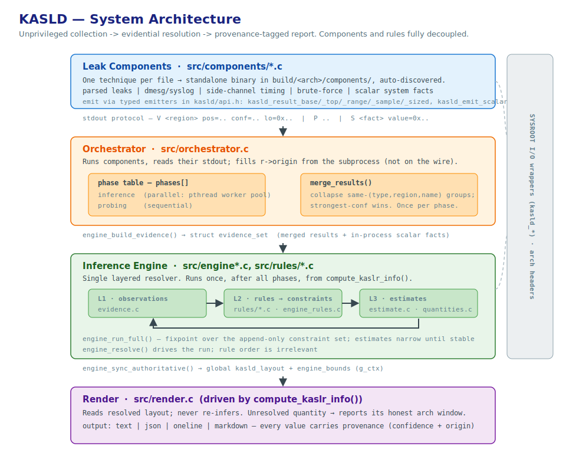
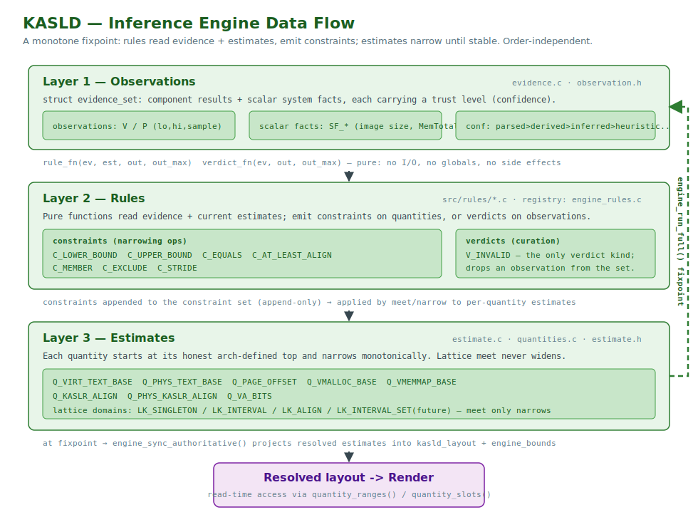
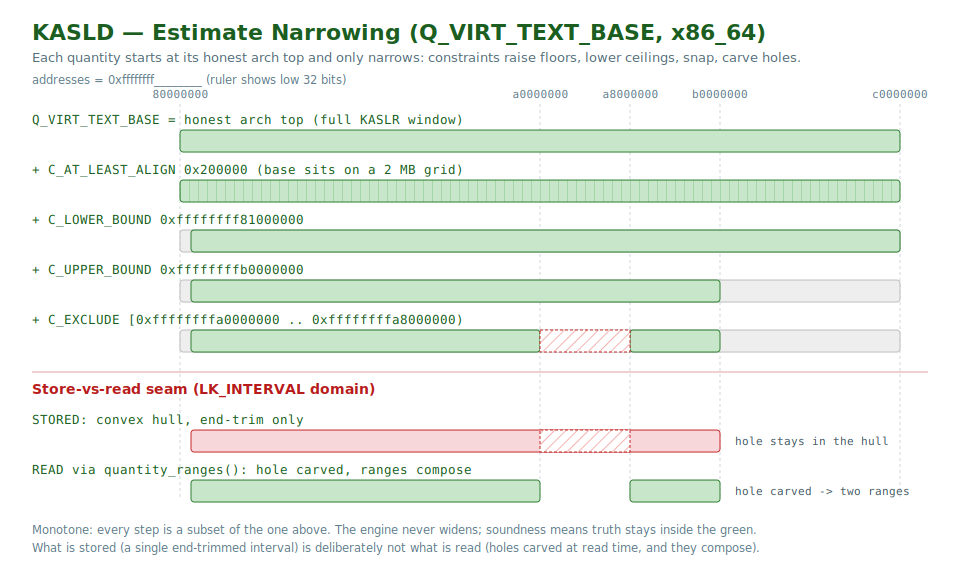
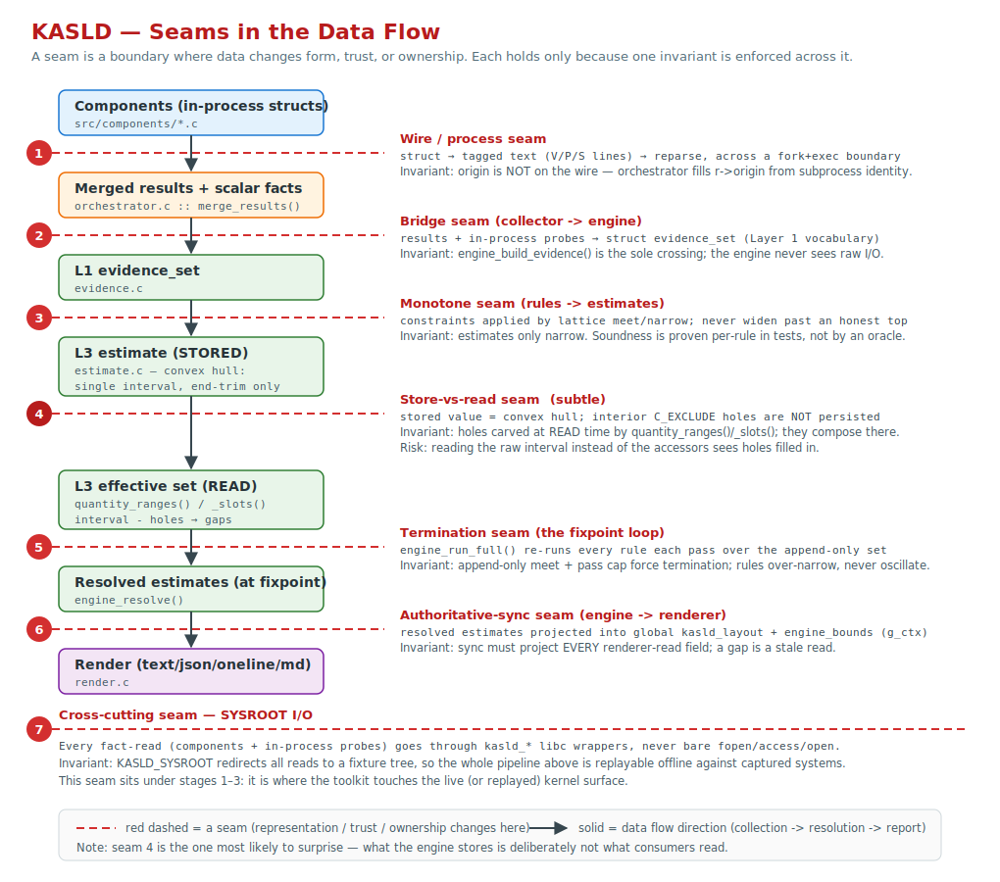
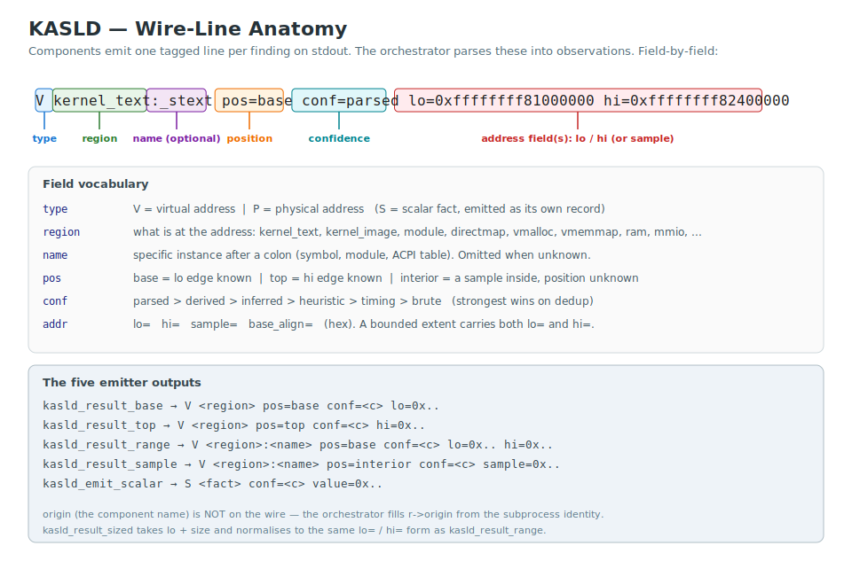

# KASLD Architecture

KASLD's architecture is a simple contract: each **component** is a standalone
executable that probes one data source and prints tagged lines to stdout. The
**orchestrator** discovers, runs, and post-processes components automatically —
no registration, no linking, no Makefile changes. The **inference engine** runs
after collection, narrowing kernel-layout quantities from the merged
observations and reporting each value with its provenance.



This document is the conceptual reference for how KASLD works. For the actionable
mechanics of adding a component or rule, see
[CONTRIBUTING.md](../CONTRIBUTING.md); for the CLI, see
[usage.md](usage.md); for KASLR itself, see [kaslr.md](kaslr.md).

## Table of Contents

- [A leak from end to end](#a-leak-from-end-to-end)
- [Components and the orchestrator](#components-and-the-orchestrator)
  - [Component model](#component-model)
  - [Phases](#phases)
- [The inference engine](#the-inference-engine)
  - [Three layers](#three-layers)
  - [Soundness, monotonicity, and termination](#soundness-monotonicity-and-termination)
  - [Estimate narrowing and the store-vs-read seam](#estimate-narrowing-and-the-store-vs-read-seam)
  - [Design invariants: seams in the data flow](#design-invariants-seams-in-the-data-flow)
- [The tagged-line protocol](#the-tagged-line-protocol)
- [Cross-region derivation](#cross-region-derivation)
  - [Component-level derivation](#component-level-derivation)
  - [Inference-time derivation](#inference-time-derivation)
  - [Coupled vs decoupled architectures](#coupled-vs-decoupled-architectures)
- [KASLR runtime states](#kaslr-runtime-states)
- [Kernel version detection](#kernel-version-detection)
- [Glossary](#glossary)

---

## A leak from end to end

One concrete example, traced through every stage, to make the rest of this
document legible. It uses a classic leak: the `free_reserved_area()` kernel-log
message that pre-v4.10 kernels printed when freeing init memory. Upstream removed
the message in v4.10, so it appears here for clarity, not because it still fires
on a current kernel — but every stage after the first is leak-agnostic, so a live
leak on a modern kernel (`perf_event_open`, a side-channel probe, …) travels the
identical path. Only the front-end component differs.

**1. The source** — a kernel log line, read from the syslog ring buffer via
`klogctl()`:

```
Freeing unused kernel memory: 1476K (ffffffff81f41000 - ffffffff820b2000)
```

**2. The component** (`dmesg_free_reserved_area`, shown minimally in
[CONTRIBUTING → Minimal component](../CONTRIBUTING.md#minimal-component)) finds
the line, parses the start address, recognises it as an address inside the kernel
image, and prints one tagged line to stdout:

```
V kernel_image pos=interior conf=parsed sample=0xffffffff81f41000
```

`V` = virtual; `kernel_image` = the region; `pos=interior` = a point somewhere
inside it, exact position unknown; `conf=parsed` = read from a structured source.
The component knows nothing about the engine — it just prints this line. See
[the tagged-line protocol](#the-tagged-line-protocol).

**3. The orchestrator** reads that line from the component's stdout, stamps it
with the component's identity (`origin`), and — once every component has finished
— bridges all collected lines into the engine's *evidence set* (the pool of
collected facts the engine reasons over), where each line becomes an
*observation*.

**4. A rule consumes it.** A *rule* is a pure function that reads the evidence and
emits bounds; the engine re-runs every rule until nothing narrows further (a
*fixpoint*). On one of those passes `range_from_interior` reads the observation
and reasons that the image base (`_text`) cannot sit *above* an address known to
be inside the image. It emits a single constraint:

```
Q_VIRT_IMAGE_BASE  <=  0xffffffff81f41000      (C_UPPER_BOUND, conf=parsed)
```

That is the honest contribution of one interior leak: a *ceiling*, not an exact
answer. A `pos=base` witness instead — `_stext` from `/proc/kallsyms`, say —
would pin the value outright via `text_pin_from_observation`. Most leaks bound
rather than pin, and bounds compose.

**5. The engine narrows.** The *estimate* for `Q_VIRT_IMAGE_BASE` — the running
range of values the image base could still take — began at its *honest top*, the
widest window the architecture allows (here the full x86_64 KASLR text range).
Meeting the new upper bound lowers its ceiling; on the same passes other rules
raise the floor (DRAM bounds) and the 2 MiB `IMAGE_ALIGN` slot grid is applied.
With only this one leak the result is still a window — several slots wide:

```
  Virtual image base   not derandomized     ~3 bits
                       0xffffffff81000000 - 0xffffffff81f41000   (7 x 2.0 MiB)
```

A second observation — a `_stext` base witness, a DRAM floor, or the
image-size gap (`image_size_text_data_gap`) — meets with this ceiling and
collapses the window toward a single slot. See
[Estimate narrowing](#estimate-narrowing-and-the-store-vs-read-seam).

**6. The renderer** reports the resolved estimate with its provenance — the
narrowed window above, or, once the constraints collapse to one slot, the pinned
base and its slide:

```
  Virtual image base   0xffffffff81e00000   slide +0xe00000
```

That is the whole path: a log line becomes an observation, a rule turns it into a
bound, the engine narrows a quantity, the renderer prints it. Every component
plugs in at stage 2; every rule at stage 4; nothing between them changes.

---

## Components and the orchestrator

### Component model

The orchestrator runs each component as an isolated child process:

1. `fork()` + `execl()` — the component runs in its own process group
2. stdout and stderr are merged into a single pipe back to the orchestrator
3. The orchestrator reads lines from the pipe, capturing tagged lines as
   results and (in verbose mode) printing all output
4. A per-component timeout (default: 30 seconds, configurable via
   `--timeout`) kills the component and its children if it does not exit
   in time
5. The exit code signals the component's relationship with its data
   source (see [Exit code convention](../CONTRIBUTING.md#exit-code-convention)).
   Tagged lines emitted before exit (or timeout) are always captured.

This model means a component that segfaults, hangs, or exits with an error
does not affect other components or the orchestrator.

Tagged lines are parsed into structured records (type, region, position,
confidence, bounds, sample), validated against the region's expected
virtual address space, and merged across components by
`(type, region, name)`. Components do not need to align addresses or
validate ranges — they emit via the intent-revealing helpers and the
orchestrator handles parsing, merging, bound tightening, and consensus.

### Phases

Components run in two phases:

| Phase | Purpose | Assignment |
|---|---|---|
| **Inference** | All non-probing components | `.kasld_meta` declares `phase:inference` (default when `phase:` is omitted) |
| **Probing** | Side-channels, timing attacks, brute-force | `.kasld_meta` declares `phase:probing` — e.g. `prefetch`, `entrybleed`, `databounce` |

Inference-phase components run in a fixed-width worker pool (default: nproc
threads). These components only *collect* — the results are merged after the
pool joins, and all inference happens afterward in a single pass of the engine,
so worker scheduling and component order have no effect on the result. The
probing phase runs after all inference components, unconditionally. Components
that cannot run on the current system (KASLR disabled, lockdown, access denied)
return `KASLD_EXIT_NOPERM` or `KASLD_EXIT_UNAVAILABLE` and are recorded as such
in the component log.

New components default to the inference phase when `phase:` is omitted from
`KASLD_META()`. Probing-phase membership requires `phase:probing` in
`.kasld_meta` — no other registration needed. The worker count, experimental
gating, and skip patterns are operational flags documented in
[usage.md](usage.md).

---

## The inference engine

After the orchestrator has collected and merged all component results, it runs a
single layered evidential engine (compiled into the orchestrator binary) to
resolve the layout. There is one inference path — no plugin system, no phase
loop.



### Three layers

- **Observations** — the collected results plus scalar system facts (kernel
  image size, MemTotal, physical-address bits, …), gathered into an evidence
  set.
- **Rules** (`../src/rules/*.c`) — ~60 pure functions that read the evidence and
  the current estimates and emit *constraints* (`>=`, `<=`, `=`, alignment,
  membership, exclusion) or *verdicts* (invalidate a result) on the quantities.
  A rule does no I/O and has no side effects, so soundness is provable in
  isolation and rule order doesn't matter.
- **Estimates** — each quantity (virtual/physical text base, `PAGE_OFFSET`,
  `vmalloc`/`vmemmap` base, KASLR alignment, VA bits) starts at its honest
  compile-time bound and only ever narrows.

The resolver re-runs every rule to a fixpoint, so a constraint one rule derives
(e.g. a tightened `PAGE_OFFSET`) feeds the next pass automatically. The resolved
estimates then drive the reported summary, slot counts, and entropy. Every rule
is listed once in `../src/engine_rules.c`, the single registry shared by the
orchestrator and the test suite.

### Soundness, monotonicity, and termination

Three properties make that fixpoint well-defined and the result trustworthy:

- **Monotonicity.** An estimate is the *meet* (intersection) of an append-only
  set of constraints, so adding a constraint can only ever narrow it — never
  widen it, and never depend on the order constraints arrive in. That is why rule
  order is irrelevant.
- **Termination.** A value that only shrinks, fed by a constraint set that only
  grows, cannot oscillate; the resolver re-runs all rules until a pass changes
  nothing, with a hard pass cap (`ENGINE_MAX_PASSES`) as a backstop. Termination
  is *structural* — it does not depend on any rule being well-behaved.
- **Soundness.** The single invariant is that the true value must never leave the
  estimate. Because each rule is a pure function (no I/O, no shared state), this
  is checkable in isolation: a rule is sound iff every constraint it emits holds
  under *every* still-possible configuration (paging level, endianness,
  unresolved Kconfig). An unsound rule can only over-narrow — risking exclusion
  of the truth — it can never make the fixpoint oscillate or hang. Rule
  soundness is exercised by the engine test suite and the replay corpus, with a
  guard that rejects unreviewed self-referential constraints.

So "soundness is provable in isolation" above means exactly this: termination and
monotonicity are guaranteed by the engine's structure, leaving each rule with a
single, locally-checkable obligation — *do not exclude the truth*.

### Estimate narrowing and the store-vs-read seam

Each quantity starts at the widest value its architecture could produce — its
*honest top* — and every constraint narrows it. Rules raise floors
(`C_LOWER_BOUND`), lower ceilings (`C_UPPER_BOUND`), snap to alignment
(`C_AT_LEAST_ALIGN`), pin a value (`C_EQUALS`), or carve out a forbidden
sub-range (`C_EXCLUDE`). Because every step is a subset of the one before, the
soundness obligation above falls on each constraint individually: narrow toward
the truth, never past it.



There is one subtlety worth calling out. The stored estimate for an interval
quantity is a **convex hull**: a single `[lo, hi]` interval, trimmed only at its
ends. An interior `C_EXCLUDE` hole is not representable in that single interval,
so it is **not** persisted in storage — it is carved at *read* time by the
`quantity_ranges()` / `quantity_slots()` accessors, and multiple holes compose
there. The consequence: what the engine stores (one end-trimmed interval) is
deliberately not what consumers read (the interval minus its holes). Any code
that reads the raw stored interval instead of going through the accessors will
see a value with its holes filled back in.

### Design invariants: seams in the data flow

KASLD's correctness rests on a handful of boundaries — *seams* — where data
changes representation, trust, or ownership, each held by one invariant:



The load-bearing ones: the **wire seam** (a component's `origin` is filled by the
orchestrator, never trusted from the wire); the **bridge seam**
(`engine_build_evidence()` is the only crossing into the engine, which never
sees raw I/O); the **monotone seam** (estimates only narrow, proven per-rule);
the **store-vs-read seam** described above; and the **authoritative-sync seam**
(the engine must project every renderer-read field, or a stale value leaks
through).

---

## The tagged-line protocol

Components communicate results to the orchestrator via tagged lines on stdout:

```
<type> <region>[:<name>] pos=<pos> conf=<conf> [lo=<hex>] [hi=<hex>|sz=<hex>] [sample=<hex>] [base_align=<hex>]
```



| Field | Format | Description |
|---|---|---|
| `type` | Single char: `P` or `V` | `P` = physical, `V` = virtual |
| `region` | Wire name from the `kasld_region` enum (snake_case) | What kind of kernel memory is at the address — closed vocabulary; see [Regions](../CONTRIBUTING.md#regions) |
| `name` | Optional, after the first `:` | The specific instance, when known (kernel symbol, ACPI OEM ID, module name, PCI BDF). Names may legitimately contain `:` (e.g. PCI BDF `0000:00:14.0`); the split is on the first `:` only |
| `pos` | `base` / `top` / `interior` / `extent` / `unknown` | What the address keys represent within the region. `base` requires `lo`, `top` requires `hi`, `interior` requires `sample`, `extent` requires both `lo` and `hi`. `unknown` requires at least one of the address keys. |
| `conf` | `parsed` / `derived` / `inferred` / `heuristic` / `timing` / `brute` | How reliable the source is. Strict trust ordering — see [Confidence](../CONTRIBUTING.md#confidence). |
| `lo` / `hi` | `0x`-prefixed hex | Inclusive extent bounds. Either may be absent. |
| `sz` | `0x`-prefixed hex | Mutually exclusive with `hi`. Parser normalizes to `hi = lo + sz - 1`. Rejected on overflow or `sz == 0`. |
| `sample` | `0x`-prefixed hex | A representative interior point. |
| `base_align` | `0x`-prefixed hex, power of two | Declared alignment of the extent base. Optional. |

A bounded extent is emitted as `pos=base` carrying both `lo` and `hi`; there is
no literal `pos=range` token on the wire. `pos=extent` is reserved for one member
of a *complete, single-source covering* of a region — a whole RAM map — whose
value lives in the gaps between extents (see [Coverings](#coverings-vs-observations)
below). Example emissions:

```
P initrd pos=base conf=parsed lo=0x33000000 hi=0x333fffff
V kernel_image:commit_creds pos=interior conf=parsed sample=0xffffffff81234000
P ram pos=top conf=parsed hi=0x100000000
V vmalloc pos=interior conf=heuristic sample=0xffffc90000123456
P ram pos=extent conf=parsed lo=0x100000 hi=0x7fedffff
```

The orchestrator ignores any line that does not begin with `P` or `V` followed
by a space, so components can freely print diagnostics. A component may emit
zero, one, or multiple tagged lines, and it never writes the format by hand — it
calls one of the five emitter helpers (see
[Emitter API](../CONTRIBUTING.md#emitter-api)), which produce the correct shape
and reject malformed inputs at the source.

---

## Coverings vs observations

Most tagged lines are **observations**: independent witnesses of a point or a
bound (`pos=base`/`top`/`interior`/`unknown`). Two observations of the same
`(type, region, name)` *corroborate* — the orchestrator's merge pass collapses
them into one record, intersecting bounds and unioning provenance.

A `pos=extent` line is different in kind. It is one member of a **complete,
single-source covering** of a region — a whole RAM map, where every E820 /
device-tree `/memory` / online hotplug extent is emitted and the kernel-relevant
value is in the **gaps between** extents (a gap is known non-RAM, so the image
cannot start there). A covering is therefore:

- **Not corroboratable, never merged.** Two sources' maps must not be mixed: a
  runtime-offlined block is RAM in the boot E820 but a hole in a hotplug view, so
  unioning would melt a real gap or synthesize a false one. Each map is
  independently complete for its own substrate.
- **Routed out-of-band.** The orchestrator sends `pos=extent` records to a
  dedicated `coverings[]` store on the evidence set, **bypassing the merge**, and
  tags each with its single emitting `origin`. The map rules
  (`ram_map_phys_exclude`, `firmware_memmap_holes`) read `coverings[]` grouped by
  origin; no other rule sees them.

The wire marker `pos=extent` is the whole contract — there is no per-component
allowlist. Because a *partial* map would carve false gaps, only whole-map sources
may emit it, enforced by `tests/check-extent-callers`.

---

## Cross-region derivation

The kernel address space contains distinct regions (text, modules, direct map,
initrd, RAM landmarks, …) at different addresses. On some architectures these
are at fixed offsets from each other (coupled), so a leak from one region can
derive addresses in another. KASLD exploits this at two levels: components can
emit derived results directly, and engine rules narrow bounds and synthesize new
derived records during the fixpoint loop after collecting all leaked results.

### Component-level derivation

Components that leak a physical address can convert it to a direct-map virtual
address using `phys_to_directmap_virt(p)`, guarded by
`#ifdef phys_to_directmap_virt` so the derivation is compiled out on arches where
the projection is unsound (x86_64 `CONFIG_RANDOMIZE_MEMORY` randomizes the
direct-map base; arm64 / riscv64 / s390 keep text and direct map at independent
runtime offsets). The component emits two records — one `PHYS`, one `VIRT` — both
with the same `(region, name)`. The merge pass keeps them as separate records
(different `type`) while engine rules use the pair to derive `PAGE_OFFSET`.

### Inference-time derivation

Engine rules read the merged records and tighten the quantity estimates
(virtual/physical text base, `PAGE_OFFSET`, etc.), emitting constraints when a
derivation is sound. Estimates only ever narrow, never widen.

Key rules for cross-region derivation:

- **`phys_virt_synth`** — pairs a `VIRT/REGION_DIRECTMAP` leak with a matching
  `PHYS` DRAM leak from the same `origin` to compute `PAGE_OFFSET = V - P`. The
  same-`origin` pairing is the tightest signal: it identifies the same kernel
  object across both address spaces.
- **`randomize_memory_page_offset`** (x86_64 only) — derives
  `virt_page_offset_base` (the randomized direct-map start under
  `CONFIG_RANDOMIZE_MEMORY`) from a `VIRT/REGION_DIRECTMAP` leak and a
  `PHYS/REGION_RAM` base record, with a 1 GiB alignment check.
- **`directmap_page_offset_bounds`** — bounds `PAGE_OFFSET` from a
  `VIRT/REGION_DIRECTMAP` leak: `PAGE_OFFSET <= V_min`, and
  `PAGE_OFFSET > V_min - phys_span`.
- **`kernel_image_phys_bound`** — uses `PHYS/REGION_KERNEL_BSS` witnesses (which
  sit past `_sdata`) to tighten `phys_base_max`.
- **`dram_floor_bound`** / **`dram_ceiling`** — use the minimum and maximum
  observed physical addresses in DRAM regions to bound the KASLR text window
  from both sides.
- **`text_cluster_filter`** — drops outlier `VIRT/REGION_KERNEL_TEXT` candidates
  that disagree with the cluster median by more than a slot threshold.
- **`initrd_phys_exclude`** / **`firmware_memmap_holes`** — emit `C_EXCLUDE`
  verdicts against `PHYS` kernel-image candidates that fall inside reserved
  intervals or outside any System RAM range.
- **`page_offset_from_landmark`** / **`page_offset_from_config`** — pin
  `Q_PAGE_OFFSET` from a `pageoffset` landmark or `CONFIG_PAGE_OFFSET`; this is
  how a runtime vmsplit propagates on coupled architectures.
- **`directmap_kaslr_disabled_pin`** (x86_64) — when `CONFIG_KASAN=y`
  (`SF_KASAN_ENABLED`) or KASLR is off (`SF_VIRT_KASLR_DISABLED`) the direct-map
  randomization is suppressed (`kaslr_memory_enabled() = kaslr_enabled() &&
  !CONFIG_KASAN`), so `Q_PAGE_OFFSET` / `Q_VMALLOC_BASE` / `Q_VMEMMAP_BASE` are
  pinned to their compile-time L4/L5 defaults — the paging level from
  `SF_VIRT_ADDR_BITS` (cpuinfo, leak-free) or, when that is unavailable, a
  resolved `Q_VA_BITS` (e.g. from a direct-map leak). Kernel TEXT KASLR is
  independent and stays randomized.

### Coupled vs decoupled architectures

Whether a physical leak reveals the virtual text base is governed by two
orthogonal per-architecture flags — `TEXT_TRACKS_DIRECTMAP` and
`DIRECTMAP_STATIC`. The quadrant they form, and which arch lives where, is
covered in [kaslr.md → Physical and virtual KASLR](kaslr.md#physical-and-virtual-kaslr).

On **coupled** architectures (x86_32, arm32, MIPS, PowerPC, LoongArch, riscv32),
a single leak from any region can produce the KASLR slide via arithmetic on the
compile-time `PAGE_OFFSET`, `PHYS_OFFSET`, and `TEXT_OFFSET` constants (with
`PAGE_OFFSET` itself runtime-detected when vmsplit differs from the compile-time
default).

On **decoupled** architectures (x86_64, arm64, riscv64, s390), physical and
virtual KASLR are randomized independently, so physical results cannot derive
virtual text directly. The summary prints a note when physical results exist that
would have been derivable on a coupled system.

RISC-V 64-bit is a special case: its module region is anchored to the kernel
image (`MODULES_VADDR = _end - 2 GiB`), so module addresses provide an additional
derivation path that `module_text_bound` exploits to estimate `_end` and bound
`kernel_text` from above.

---

## KASLR runtime states

KASLD distinguishes three distinct "KASLR is not adding entropy" states because
they have different implications for the inference engine:

| State | Scalar fact(s) | Kernel position | Engine action |
|---|---|---|---|
| **Disabled** (user/build opt-out) | `SF_VIRT_KASLR_DISABLED` + `SF_PHYS_KASLR_DISABLED` | Compile-time default on each axis | `virt_kaslr_disabled_pin` pins `Q_VIRT_IMAGE_BASE` on arches that set `KASLR_DISABLED_PINS_VIRT_TEXT`; `phys_kaslr_disabled_pin` pins `Q_PHYS_IMAGE_BASE` on arches that set `KASLR_DISABLED_PINS_PHYS`; on x86_64 `directmap_kaslr_disabled_pin` also pins the direct-map bases |
| **Direct map unrandomized** (x86_64 `CONFIG_KASAN`) | `SF_KASAN_ENABLED` | TEXT still randomized; `page_offset` / `vmalloc` / `vmemmap` at their L4/L5 defaults | `directmap_kaslr_disabled_pin` pins the three direct-map quantities — `kaslr_memory_enabled() = kaslr_enabled() && !CONFIG_KASAN`, so KASAN suppresses `RANDOMIZE_MEMORY` even when it is configured |
| **Unsupported** (arch never had KASLR) | both `SF_*_KASLR_DISABLED` synthesized with origin `arch-no-kaslr` | Bootloader-determined | Inert for inference (these arches set neither pin flag); lights the renderer's "KASLR not supported" banner |
| **Randomization failed** (boot stub tried, no entropy) | `SF_VIRT_KASLR_RANDOMIZATION_FAILED` + `SF_PHYS_KASLR_RANDOMIZATION_FAILED` | Firmware-/boot-stub-deterministic, NOT the link-time default | Does not pin. Drives the hardening-report entropy downgrade, `efi_loader_kernel_pick` lowest-survivor disambiguation, and the `s390_text_no_random` upper bound |

**Disabled.** KASLD treats the virtual and physical disable signals as
independent scalar facts because real kernels can disable one axis without the
other. A handful of components detect a definitive opt-out and emit the pair —
proc_cmdline (`nokaslr`), boot_config / proc_config (no `CONFIG_RANDOMIZE_BASE`),
dmesg_kaslr_disabled, hibernation_nokaslr, riscv64_no_seed,
loongarch_kexec_file_nokaslr, s390_kdump_nokaslr. The orchestrator reads
`SF_VIRT_KASLR_DISABLED` to set the summary's `kaslr.disabled` flag (driving the
"kernel sits at default text base" banner and `slide`/`slot` zeroing). The
engine's `virt_kaslr_disabled_pin` pins `Q_VIRT_IMAGE_BASE` to the compile-time
default on arches that set `KASLR_DISABLED_PINS_VIRT_TEXT` (x86_64, arm64,
riscv64, loongarch64, s390), gated by a window-containment soundness check;
`phys_kaslr_disabled_pin` does the analogous job for `Q_PHYS_IMAGE_BASE` on arches
that set `KASLR_DISABLED_PINS_PHYS` (currently x86_64 and loongarch64).

**Unsupported.** "KASLR not supported" (compile-time `KASLR_SUPPORTED=0` — arm32,
ppc64, riscv32, sparc) is synthesized by the orchestrator as both facts with
origin `arch-no-kaslr`, inert for inference, but lights the renderer's "KASLR not
supported" banner.

**Randomization failed.** Distinct from disabled: the KASLR machinery was enabled
and ran in the boot stub, but could not produce a random offset because the
entropy source was unavailable (arm64 / riscv64 "lack of seed", arm64 "FDT
remapping failure", s390 "CPU has no PRNG"). The kernel was still relocated to a
firmware-/boot-stub-deterministic position — *not* the link-time default — so
this signal MUST NOT be fed to the `_kaslr_disabled_pin` rules. The summary flag
`kaslr.disabled` stays *false*: the engine has not pinned the kernel to a known
address, even though no random offset was applied. The three engine consumers are
the hardening-report entropy downgrade (`-H` mode), `efi_loader_kernel_pick`
(prefer the lowest-addressed EFI survivor at `CONF_HEURISTIC`), and
`s390_text_no_random` (a conservative `C_UPPER_BOUND` on `Q_PHYS_IMAGE_BASE`).

---

## Kernel version detection

Some techniques (e.g. EntryBleed) have been mitigated in specific mainline
kernel releases. It would seem natural to check `uname -r` and skip components
that target patched vulnerabilities. **KASLD deliberately does not do this.**

Distribution kernels (Ubuntu, Debian, RHEL, SUSE, etc.) backport security fixes
extensively, and their version numbers do not correspond to the mainline release
where a fix appeared:

- Ubuntu ships `4.4.0-xxx` and `4.15.0-xxx` LTS kernels containing backported
  fixes from mainline 5.x and 6.x.
- RHEL ships `3.10.0-xxx` kernels with fixes from mainline 4.x and 5.x.
- A kernel reporting `6.8.0` may lack a fix from mainline 6.3, or include a fix
  from mainline 6.12, depending on the distributor.

Version-based gating would be wrong in both directions: skipping a technique on a
kernel that is actually vulnerable (false negative), or running a technique on a
kernel that has already been patched (false positive).

Instead, KASLD treats each component as its own detector. Components probe the
actual kernel — they either produce a result or they don't. Side-channel
components that target patched vulnerabilities time out (bounded by `--timeout`)
or exit with no output, which the orchestrator handles gracefully. This design
means KASLD is correct on any kernel — mainline, distro, custom, or embedded —
without maintaining per-component version ranges that would be inaccurate for
most real-world deployments.

---

## Glossary

KASLD's engine and tool vocabulary. For KASLR and kernel-memory-layout terms
(slide, vmsplit, directmap, vmemmap, …), see
[kaslr.md → Glossary](kaslr.md#glossary).

- **observation** — a single tagged-line witness of a point or bound
  (`pos=base`/`top`/`interior`/`unknown`). Observations of the same
  `(type, region, name)` corroborate and merge. See
  [Coverings vs observations](#coverings-vs-observations).
- **covering** — a complete, single-source map of a region (e.g. a whole RAM map)
  emitted as `pos=extent`. Never merged, routed out-of-band; the kernel-relevant
  value lives in the gaps between extents. See
  [Coverings vs observations](#coverings-vs-observations).
- **quantity** — a kernel-layout unknown the engine resolves: `Q_VIRT_TEXT_BASE`,
  `Q_PHYS_TEXT_BASE`, `Q_PAGE_OFFSET`, `Q_VA_BITS`, … See
  [Three layers](#three-layers).
- **estimate** — the current resolved value of a quantity: an interval that only
  ever narrows. See
  [Estimate narrowing](#estimate-narrowing-and-the-store-vs-read-seam).
- **honest top (honest bound)** — a quantity's widest starting value, the most its
  architecture could produce, before any constraint applies. See
  [Estimate narrowing](#estimate-narrowing-and-the-store-vs-read-seam).
- **constraint** — a bound a rule emits on a quantity: `C_LOWER_BOUND`,
  `C_UPPER_BOUND`, `C_EQUALS`, `C_AT_LEAST_ALIGN`, `C_MEMBER`, `C_EXCLUDE`,
  `C_STRIDE`. See [Three layers](#three-layers).
- **rule** — a pure function reading the evidence and current estimates and
  emitting constraints or verdicts. No I/O, no state, order-independent. See
  [Three layers](#three-layers).
- **verdict** — a rule output that invalidates an observation (`V_INVALID`) rather
  than bounding a quantity. See [Three layers](#three-layers).
- **meet** — the intersection that folds an append-only constraint set into an
  estimate; the basis of monotonicity. See
  [Soundness, monotonicity, and termination](#soundness-monotonicity-and-termination).
- **fixpoint** — the resolver re-running every rule until a pass narrows nothing.
  See [The inference engine](#the-inference-engine).
- **pinned** — a quantity narrowed to a single value (`lo == hi`); reported as a
  resolved address rather than a range. See
  [Estimate narrowing](#estimate-narrowing-and-the-store-vs-read-seam).
- **store-vs-read seam** — the engine stores a single convex-hull interval, while
  the accessors carve interior `C_EXCLUDE` holes at read time. See
  [Estimate narrowing and the store-vs-read seam](#estimate-narrowing-and-the-store-vs-read-seam).
- **`pos` / `conf` / `region`** — the wire-line fields: position within a region /
  confidence (`parsed > derived > inferred > heuristic > timing > brute`) /
  region vocabulary. See [The tagged-line protocol](#the-tagged-line-protocol).
- **`TEXT_TRACKS_DIRECTMAP` / `DIRECTMAP_STATIC`** — the two orthogonal per-arch
  flags that name the coupled/decoupled relationship. See
  [Coupled vs decoupled architectures](#coupled-vs-decoupled-architectures).
