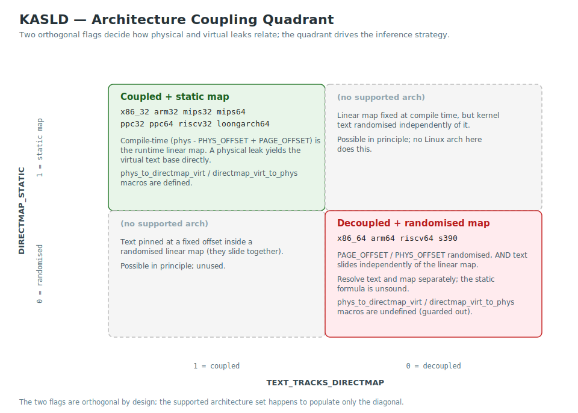
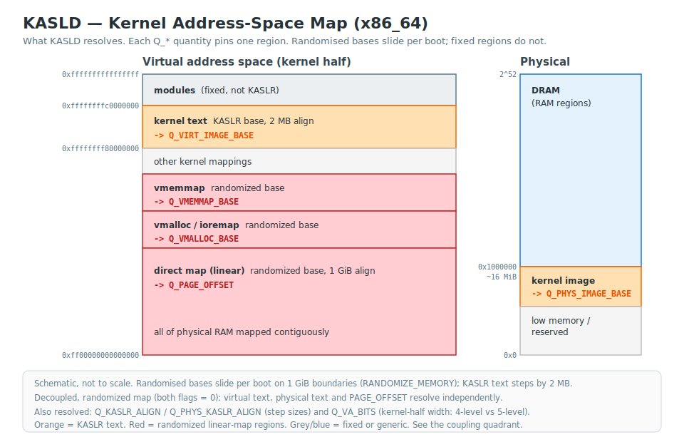

# KASLR and Kernel Memory Layout

Reference material on how Linux KASLR works, what it randomises, and how
the kernel virtual address space is laid out across architectures.

## Table of Contents

- [Linux KASLR history and implementation](#linux-kaslr-history-and-implementation)
  - [Default text base and KASLR alignment](#default-text-base-and-kaslr-alignment)
  - [KASLR runtime states](#kaslr-runtime-states)
- [Physical and virtual KASLR](#physical-and-virtual-kaslr)
- [Kernel sections](#kernel-sections)
- [Virtual memory split (vmsplit)](#virtual-memory-split-vmsplit)
- [Function Granular KASLR (FG-KASLR)](#function-granular-kaslr-fg-kaslr)

## Linux KASLR history and implementation

Not all architectures support KASLR (`CONFIG_RANDOMIZE_BASE`) or enable it by
default:

| Architecture | KASLR Added | Date | Default On | Notes |
|---|---|---|---|---|
| x86_32 | v3.14 ([`8ab3820fd5b2`](https://github.com/torvalds/linux/commit/8ab3820fd5b2)) | 2013-10-13 | v4.12 ([`09e43968fc6c`](https://github.com/torvalds/linux/commit/09e43968fc6c)) | Kconfig `default y` since v4.12 |
| x86_64 | v3.14 ([`8ab3820fd5b2`](https://github.com/torvalds/linux/commit/8ab3820fd5b2)) | 2013-10-13 | v4.12 ([`09e43968fc6c`](https://github.com/torvalds/linux/commit/09e43968fc6c)) | Kconfig `default y` since v4.12 |
| arm64 | v4.6 ([`f80fb3a3d508`](https://github.com/torvalds/linux/commit/f80fb3a3d508)) | 2016-02-24 | Yes (defconfig) | Enabled in upstream arm64 defconfig |
| MIPS32 | v4.7 ([`405bc8fd12f5`](https://github.com/torvalds/linux/commit/405bc8fd12f5)) | 2016-05-13 | No | Max offset 128 MiB (limited by KSEG0) |
| MIPS64 | v4.7 ([`405bc8fd12f5`](https://github.com/torvalds/linux/commit/405bc8fd12f5)) | 2016-05-13 | No | Max offset 1 GiB |
| s390 | v5.2 ([`b2d24b97b2a9`](https://github.com/torvalds/linux/commit/b2d24b97b2a9)) | 2019-04-29 | v5.2 | Kconfig `default y` from initial commit |
| PowerPC32 | v5.5 ([`2b0e86cc5de6`](https://github.com/torvalds/linux/commit/2b0e86cc5de6)) | 2019-11-13 | No | BookE/e500 (PPC_85xx) only |
| LoongArch | v6.3 ([`e5f02b51fa0c`](https://github.com/torvalds/linux/commit/e5f02b51fa0c)) | 2023-02-25 | Yes (defconfig) | Enabled in upstream loongson3_defconfig |
| RISC-V64 | v6.6 ([`84fe419dc757`](https://github.com/torvalds/linux/commit/84fe419dc757)) | 2023-07-22 | No | |
| arm32 | — | — | — | Not supported |
| PowerPC64 | — | — | — | Not supported |
| sparc | — | — | — | Not supported |

Even where KASLR is unsupported, disabled, or failed to randomize, the
kernel's load address may still vary across boots: a bootloader
(U-Boot, GRUB, the EFI stub, Coreboot, etc.) is free to place the image
at whatever physical address suits the board's memory map. The kernel
is not actively randomising in that case, but the base is still unknown
to an unprivileged user a priori. KASLD treats this case identically —
the same inference engine narrows the bootloader-chosen base from
observable evidence (`dmesg` landmarks, `/proc/iomem`, `/sys` facts,
devicetree reservations) to a residual window, or to a single address
where the evidence allows. See [KASLR runtime states](#kaslr-runtime-states)
below for the distinction between *disabled* (kernel at the link-time
default), *unsupported* (arch has no KASLR machinery), and
*randomization failed* (boot stub tried but no random offset applied).

See also:

* [grsecurity - KASLR: An Exercise in Cargo Cult Security](https://grsecurity.net/kaslr_an_exercise_in_cargo_cult_security) (grsecurity, 2013)
* [An Info-Leak Resistant Kernel Randomization for Virtualized Systems | IEEE Journals & Magazine | IEEE Xplore](https://ieeexplore.ieee.org/document/9178757) (Fernando Vano-Garcia, Hector Marco-Gisbert, 2020)
* Kernel Address Space Layout Randomization (LWN.net)
  * [Kernel address space layout randomization [LWN.net]](https://lwn.net/Articles/569635/)
  * [Randomize kernel base address on boot [LWN.net]](https://lwn.net/Articles/444556/)
  * [arm64: implement support for KASLR [LWN.net]](https://lwn.net/Articles/673598/)
* [Kernel load address randomization · Linux Inside](https://0xax.gitbooks.io/linux-insides/content/Booting/linux-bootstrap-6.html)
* KASLR Kconfig options:
  * [CONFIG_RANDOMIZE_BASE: Randomize the address of the kernel image (KASLR)](https://cateee.net/lkddb/web-lkddb/RANDOMIZE_BASE.html)
  * [CONFIG_RANDOMIZE_BASE_MAX_OFFSET: Maximum kASLR offset](https://cateee.net/lkddb/web-lkddb/RANDOMIZE_BASE_MAX_OFFSET.html)
  * [CONFIG_RANDOMIZE_MEMORY: Randomize the kernel memory sections](https://cateee.net/lkddb/web-lkddb/RANDOMIZE_MEMORY.html)
  * [CONFIG_RANDOMIZE_MEMORY_PHYSICAL_PADDING: Physical memory mapping padding](https://cateee.net/lkddb/web-lkddb/RANDOMIZE_MEMORY_PHYSICAL_PADDING.html)
  * [CONFIG_RELOCATABLE: Build a relocatable kernel](https://cateee.net/lkddb/web-lkddb/RELOCATABLE.html)

### Default text base and KASLR alignment

When KASLR is disabled, the kernel loads at a fixed virtual address — the
"default text base." This address is determined by the architecture's linker
script, Kconfig options, or hardware memory map. When KASLR is enabled, the
kernel is placed at `default + N × IMAGE_ALIGN`, where N is chosen randomly
within the architecture's valid range. `IMAGE_ALIGN` is therefore the
randomization granularity: each possible position is one "KASLR slot."

The table is the kernel's compile-time default — the address the image
lands at when no relocation occurs. On relocating architectures (every
supported arch except PowerPC64 and SPARC) the bootloader chooses the
load address from the board's memory map. The table is the baseline
against which the KASLR slide is measured, not the load address on every
system.

The "default text base" here is the **image base** (`_text`) — the start of
the kernel image, which is what KASLR aligns and what kasld reports. The
familiar `_stext` (start of the code section) sits a fixed *head gap* above
`_text`: zero on most architectures (so `_text == _stext`), but non-zero where
a header precedes the code (arm64's `.head.text`, `0x10000`). kasld solves the
image base and shows `_stext` as a derived line only when the two differ; a
leaked `_stext` (e.g. from `/proc/kallsyms`) is normalised back to the image
base when it is consumed, so the slide is always measured against `_text`.

| Architecture | Default text base | Derivation | `IMAGE_ALIGN` | KASLR slots | Entropy |
|---|---|---|---|---|---|
| x86_64 | `0xffffffff81000000` | `__START_KERNEL_map` + `PHYSICAL_START` (`page_64_types.h`) | 2 MiB | 504² | ~9 bits |
| x86_32 | `0xc0000000` | `PAGE_OFFSET` (3G/1G vmsplit default) | 2 MiB | 248² | ~8 bits |
| arm64 | `0xffff800080000000` | `KIMAGE_VADDR` (`memory.h`); module region size determines offset from `_PAGE_END` | 2 MiB¹ | ~33M | ~25 bits |
| arm32 | `0xc0008000` | `PAGE_OFFSET` + `TEXT_OFFSET` (`0x8000`, from `arch/arm/Makefile`) | — | — | No KASLR |
| MIPS32 | `0x80100400` | KSEG0 (`0x80000000`) + 1 MiB + `TEXT_OFFSET` (`0x400`, from `head.S`) | 64 KiB | varies | varies |
| MIPS64 | `0xffffffff80100400` | CKSEG0 (`0xffffffff80000000`) + 1 MiB + `TEXT_OFFSET` (`0x400`) | 64 KiB | varies | varies |
| s390 | `0x3FFE0100000` | `CONFIG_KERNEL_IMAGE_BASE` + `TEXT_OFFSET` (1 MiB) | 16 KiB | ~131K | ~17 bits |
| PowerPC32 | `0xc0000000` | `PAGE_OFFSET` (3G/1G default); BookE only | 16 KiB¹ | varies | varies |
| PowerPC64 | `0xc000000000000000` | `PAGE_OFFSET` (Kconfig) | — | — | No KASLR |
| LoongArch | `0x9000000000200000` | DMW1 (`0x9000000000000000`) + `TEXT_OFFSET` (2 MiB, from `Makefile`) | 64 KiB | varies | varies |
| RISC-V64 | `0xffffffff80002000` | `KERNEL_LINK_ADDR` (top 2 GiB of VA) + `TEXT_OFFSET` (`0x2000`, `.head.text`) | 2 MiB | 512² | ~9 bits |
| RISC-V32 | `0xc0002000` | `PAGE_OFFSET` + `TEXT_OFFSET` (`0x2000`) | — | — | No KASLR |

The "Derivation" column shows where each default address comes from. On
most architectures the formula is `PAGE_OFFSET + TEXT_OFFSET`, where
`PAGE_OFFSET` is the start of the kernel virtual address space (set by
hardware mapping or Kconfig) and `TEXT_OFFSET` is the offset from the
mapping base to the `.text` section entry point (set by the linker script
or boot protocol). x86_64 is an exception: the kernel image virtual base
(`__START_KERNEL_map = 0xffffffff80000000`) is separate from `PAGE_OFFSET`
(the direct-map base), and `PHYSICAL_START` (16 MiB) is added for
alignment with the physical load address.

¹ These architectures define a separate `KASLR_VIRT_ALIGN` larger than
`IMAGE_ALIGN` (the image alignment). The table shows the KASLR slot
granularity. arm64: `IMAGE_ALIGN` = 64 KiB, `KASLR_VIRT_ALIGN` = 2 MiB.
PowerPC32: `IMAGE_ALIGN` = 4 KiB, `KASLR_VIRT_ALIGN` = 16 KiB.

² The slot count is an upper bound. Every architecture's KASLR placement
code refuses positions where the image would extend past the end of the
randomization region, so the actual available slots are:

```
valid_slots = (range_size - kernel_size) / IMAGE_ALIGN
```

`kernel_size` is measured differently per architecture. On x86
(`arch/x86/boot/compressed/kaslr.c`), it is `init_size` from the boot
header — the decompression buffer requirement, which is larger than the
final loaded kernel size. On RISC-V (`arch/riscv/mm/init.c`), it is
`_end − _start` — the actual in-memory kernel size with no overhead.
On x86, `MODULES_VADDR` is defined as `__START_KERNEL_map +
KERNEL_IMAGE_SIZE` with no gap, so the ceiling is hard.

| Architecture | Max slots | Approx. `kernel_size` | Typical runtime slots | Reduction |
|---|---|---|---|---|
| x86_64 | 504 | `init_size` ≈ 70 MiB | ~469 | ~7% |
| x86_32 | 248 | `init_size` ≈ 40 MiB | ~228 | ~8% |
| RISC-V64 | 512 | `_end−_start` ≈ 30 MiB | ~497 | ~3% |
| s390 | ~131K | ≈ 70 MiB | ~127K | ~3% |
| arm64 | ~33M | ≈ 50 MiB | ~33M | <0.01% |

On x86 and RISC-V, where total entropy is ~9 bits (~500 slots), a 3–8%
reduction is material. On s390 (~17 bits) and arm64 (~25 bits) the
effect is negligible.

### KASLR runtime states

A KASLR-capable architecture can be in one of four runtime states on
any given boot. The states have different exploitation implications
and KASLD reports them distinctly:

| State | Where the kernel landed | Slot entropy | Bootloader entropy |
|---|---|---|---|
| **Active** | One of `valid_slots` positions chosen uniformly | Full (`log2(valid_slots)`) | Subsumed by KASLR — placement is randomised within the bootloader-determined range |
| **Disabled** | The arch's compile-time default text base, exactly | 0 bits — fully predictable | None — opt-out is honoured before the bootloader chooses |
| **Unsupported** | Bootloader-determined physical address; virtual address is hardware-fixed (e.g. `PAGE_OFFSET + TEXT_OFFSET` on arm32) | 0 bits — arch has no KASLR machinery | Whatever entropy the bootloader's placement policy provides — often per-boot deterministic |
| **Randomization failed** | Boot-stub- or firmware-deterministic, *not* the link-time default | 0 bits — boot stub skipped the random offset | Whatever entropy the deterministic fallback path provides — typically the lowest aligned slot the firmware allocator returns, identical across boots on the same hardware |

The four states are entered by different mechanisms:

- **Active** — the default for any KASLR-supporting arch when the
  entropy source is available and not opted out.

- **Disabled** is reached by an explicit opt-out:
  - `nokaslr` on the kernel cmdline (every KASLR-supporting arch).
  - `CONFIG_RANDOMIZE_BASE=n` at build time.
  - Hibernation resume on x86 (the kernel must land at the same
    address as the snapshot, so KASLR is forced off — see
    `arch/x86/boot/compressed/kaslr.c`).
  - The `kexec_file` token on LoongArch (kernel loaded by
    `kexec_file_load(2)` honours the loader's chosen address).
  - The `elfcorehdr=` kdump handoff path on s390 (the panic kernel
    must land at a known address).
  - FDT without `/chosen/kaslr-seed` on riscv64 non-EFI boot (the
    kernel falls back to the link-time default; the EFI path goes
    through the *randomization failed* state instead).

- **Unsupported** applies to architectures where the kernel build
  has no KASLR machinery: arm32, PowerPC64, RISC-V32, SPARC.

- **Randomization failed** applies when the KASLR machinery ran but
  could not produce a random offset:
  - arm64 EFI stub: no `EFI_RNG_PROTOCOL`, no FDT `kaslr-seed`
    (dmesg: `KASLR disabled due to lack of seed`).
  - arm64: FDT remap failure during early init
    (dmesg: `KASLR disabled due to FDT remapping failure`).
  - s390 boot stub: CPU has no PRNG instruction
    (dmesg: `KASLR disabled: CPU has no PRNG`).
  - s390 boot stub: not enough memory to relocate
    (dmesg: `KASLR disabled: not enough memory`).
  - riscv64 EFI stub: the same shape as arm64 (`EFI_RNG_PROTOCOL`
    falls back to a deterministic firmware-allocated position when
    no random source is exposed). The riscv64 no-seed dmesg signal
    is not always emitted by the kernel; whether the engine enters
    the *randomization failed* or *disabled* state depends on which
    indicator the components observe.

The dmesg line in the third state begins with the same `KASLR
disabled` prefix as a deliberate opt-out — distinguishing them
requires inspecting the reason text. The kernel is still relocated by
the boot stub but lands at a firmware-determined position rather than
the link-time default, so consumers MUST NOT treat this signal as a
pin-to-default. KASLD emits a distinct scalar fact
(`SF_VIRT_KASLR_RANDOMIZATION_FAILED` + `SF_PHYS_KASLR_RANDOMIZATION_FAILED` versus `SF_VIRT_KASLR_DISABLED` +
`SF_PHYS_KASLR_DISABLED`) and neither sets the summary's
`kaslr.disabled` flag nor pins `Q_VIRT_IMAGE_BASE` or `Q_PHYS_IMAGE_BASE`
from this signal.

Per-host fingerprintability: in the *randomization failed* state, the
position is deterministic per (firmware, kernel build, hardware)
tuple. An operator who has previously captured ground truth on the
same machine can re-use the slide on subsequent boots without
re-leaking — a substantively different security posture from active
KASLR where each boot is independent.

## Physical and virtual KASLR

Linux KASLR randomizes the kernel location in both physical memory (where the
kernel image resides in RAM) and virtual memory (where the kernel is mapped in
the address space). Depending on the architecture, these may be randomized
together using a single offset (coupled) or independently using separate offsets
(decoupled).

On architectures where physical and virtual randomization are coupled (i.e.
the same offset), leaking either a physical or virtual kernel address
trivially reveals the other. On architectures where they are decoupled,
a physical address leak does not directly reveal the virtual address
(and vice versa), providing stronger isolation.

| Architecture | Phys/Virt Relationship | Since | Notes |
|---|---|---|---|
| x86_32 | Coupled | v3.14 | Virtual offset equals physical offset |
| arm64 | Decoupled | v4.6 | EFI stub randomizes physical; `kaslr_early_init` randomizes virtual; linear map has limited entropy |
| MIPS32/64 | Coupled | v4.7 | Single relocation offset; fixed kseg0 virt-to-phys mapping |
| x86_64 | Decoupled | v4.8 | Separate `find_random_phys_addr` / `find_random_virt_addr`; also `CONFIG_RANDOMIZE_MEMORY` for memory sections |
| s390 | Coupled (identity) | v5.2 | 1:1 virtual = physical mapping |
| PowerPC32 | Coupled | v5.5 | Same offset applied to both addresses |
| LoongArch | Coupled | v6.3 | Single relocation offset; direct-mapped windows |
| RISC-V64 | Virtual only | v6.6 | Only virtual address randomized; physical depends on bootloader |

KASLD models this relationship with two orthogonal per-architecture flags —
`TEXT_TRACKS_DIRECTMAP` (does kernel text slide with the linear map?) and
`DIRECTMAP_STATIC` (is the compile-time direct-map projection sound at runtime?).
The quadrant they form decides the inference strategy, and every supported
architecture sits on its diagonal:



See also:

* [security things in Linux v4.8](https://outflux.net/blog/archives/2016/10/04/security-things-in-linux-v4-8/) (Kees Cook, 2016) — describes x86_64 physical/virtual decoupling and `CONFIG_RANDOMIZE_MEMORY`
* [x86, boot: KASLR memory randomization [LWN.net]](https://lwn.net/Articles/687353/) (Thomas Garnier, 2016) — `CONFIG_RANDOMIZE_MEMORY` patch series
* [Kernel load address randomization · Linux Inside](https://0xax.gitbooks.io/linux-insides/content/Booting/linux-bootstrap-6.html) — detailed walkthrough of `choose_random_location()` on x86

## Kernel sections

The kernel virtual address space contains distinct sections (text, modules,
direct map, etc.) mapped at different address ranges. KASLR randomizes the
kernel text base address, but not all sections are randomized together —
depending on the architecture, other sections may be at fixed addresses,
use the same KASLR offset, or be randomized independently.

The map below shows the x86_64 virtual and physical address spaces, with the
KASLD quantity (`Q_*`) that resolves each region annotated alongside it:



| Architecture | Text ↔ Phys | Text ↔ Direct map | Text ↔ Modules | Notes |
|---|---|---|---|---|
| x86_64 | Independent | Independent | Independent | Three separate randomizations (`CONFIG_RANDOMIZE_MEMORY`) |
| x86_32 | Coupled | Coupled | Fixed module region | Single KASLR offset |
| arm64 | Independent | Independent | Fixed module region | Separate phys/virt randomization |
| arm32 | — | Coupled | Fixed (PAGE_OFFSET - 16M) | No KASLR |
| MIPS32/64 | Coupled | Coupled (kseg0) | Fixed module region | Hardware-defined mapping |
| PowerPC32 | Coupled | Coupled | Fixed (PAGE_OFFSET - 256M) | |
| PowerPC64 | — | Coupled | Shared VAS | No KASLR |
| LoongArch64 | Coupled | Coupled | Fixed module region | Direct-mapped windows |
| RISC-V64 | Virtual only | Decoupled | Coupled (shifts with kernel) | Module region anchored to kernel `_end`; text ↔ directmap coupled on legacy pre-v5.10 kernels (no KASLR) |
| RISC-V32 | — | Coupled | Same as PAGE_OFFSET | No KASLR |

On coupled architectures, all sections are at fixed offsets from each other:
a physical address reveals the virtual text base via
`phys_to_directmap_virt()`, the direct map is at a known offset
(`TEXT_OFFSET`) from the text base, and
modules are either at a fixed address or a constant offset from `PAGE_OFFSET`.
A single leak from any section is sufficient to derive the others. On
decoupled architectures like x86_64, each section is randomized independently
— a physical address tells you nothing about the virtual text base, and the
direct map base (`virt_page_offset_base`) is randomized separately.

RISC-V64 is notable: the module region is anchored to the kernel image
(`MODULES_VADDR = PFN_ALIGN(&_end) - SZ_2G`, `MODULES_END = PFN_ALIGN(&_start)`),
so modules shift with the randomized kernel rather than occupying a fixed
region. See
[architecture.md → Cross-region derivation](architecture.md#cross-region-derivation)
for how KASLD exploits this.

## Virtual memory split (vmsplit)

On 32-bit systems, the 4 GiB virtual address space is divided between
userspace and the kernel. The boundary — `PAGE_OFFSET` (also known as
the "vmsplit") — determines where the kernel virtual address space begins.

The most common configuration is a 3G/1G split (`PAGE_OFFSET=0xC0000000`),
but embedded systems and custom kernels may use different splits:

| Split | `PAGE_OFFSET` | User / Kernel | Notes |
|---|---|---|---|
| 1G/3G | `0x40000000` | 1 GiB / 3 GiB | Rare |
| 2G(opt)/2G | `0x78000000` | ~1.9 GiB / ~2.1 GiB | x86_32 only |
| 2G/2G | `0x80000000` | 2 GiB / 2 GiB | Common on embedded ARM |
| 3G(opt)/1G | `0xB0000000` | ~2.75 GiB / ~1.25 GiB | x86_32 only |
| 3G/1G | `0xC0000000` | 3 GiB / 1 GiB | Default for most distros |

The vmsplit affects nearly all kernel virtual address boundaries: the kernel
text base, direct map, and (on some architectures) the module region all
shift with `PAGE_OFFSET`. This means KASLR analysis, address validation,
and memory layout interpretation depend on knowing the correct vmsplit.

Since KASLD is typically compiled on one system and deployed to another,
the compile-time `PAGE_OFFSET` assumption may not match the target system.
KASLD handles this at runtime: components that detect the actual `PAGE_OFFSET`
(e.g. `mmap_brute_vmsplit`, `boot_config`) emit a `pageoffset` tagged result,
and the orchestrator automatically adjusts all layout boundaries before
performing validation and analysis.

| Architecture | Configurable vmsplit | Config option | Default |
|---|---|---|---|
| x86_32 | Yes | `CONFIG_VMSPLIT_*` | `0xC0000000` (3G/1G) |
| arm32 | Yes | `CONFIG_PAGE_OFFSET` / `CONFIG_VMSPLIT_*` | `0xC0000000` (3G/1G) |
| PowerPC32 | Yes | `CONFIG_PAGE_OFFSET` | `0xC0000000` (3G/1G) |
| x86_64 | No | — | `0xFF00000000000000` (5-level) / `0xFFFF800000000000` (4-level) |
| arm64 | No | — | `0xFFF0000000000000` (52-bit VA) |
| MIPS32 | No | — | `0x80000000` (hardware kseg0) |
| MIPS64 | No | — | `0xFFFFFFFF80000000` (xkseg) |
| PowerPC64 | No | — | `0xC000000000000000` |
| LoongArch64 | No | — | `0x9000000000000000` |
| RISC-V32 | No | — | `0xC0000000` |
| RISC-V64 | No | — | `0xFF60000000000000` (SV57) |

See also:

* [0xAX/linux-insides](https://github.com/0xAX/linux-insides)
  * https://github.com/0xAX/linux-insides/tree/master/Initialization
  * https://github.com/0xAX/linux-insides/blob/master/Theory/linux-theory-1.md
  * https://github.com/0xAX/linux-insides/tree/master/MM
* [Virtual Memory and Linux](https://elinux.org/images/b/b0/Introduction_to_Memory_Management_in_Linux.pdf) (Matt Porter, 2016)
* [Understanding the Linux Virtual Memory Manager](https://www.kernel.org/doc/gorman/html/understand/index.html) (Mel Gorman, 2004)
* Linux Kernel Programming (Kaiwan N Billimoria, 2021)

## Function Granular KASLR (FG-KASLR)

Function Granular KASLR (aka "finer-grained KASLR") patches for the 5.5.0-rc7
kernel were [proposed in February 2020](https://lwn.net/Articles/811685/) but
**have not been merged as of 2026**.

This optional non-mainline mitigation ["rearranges your kernel code at load time on a per-function level granularity"](https://lwn.net/Articles/811685/)
and can be enabled with the [CONFIG_FG_KASLR](https://patchwork.kernel.org/project/linux-hardening/patch/20211223002209.1092165-8-alexandr.lobakin@intel.com/) flag.

FG-KASLR ensures the location of kernel and module functions are independently
randomized and no longer located at a constant offset from the kernel `.text`
base.

On systems which support FG-KASLR patches (x86_64 from 2020, arm64 from 2023),
this makes calculating offsets to useful functions more difficult and renders
kernel pointer leaks significantly less useful.

However, some regions of the kernel are not randomized (such as symbols before
`__startup_secondary_64` on x86_64) and offsets remain consistent across reboots.
Additionally, FG-KASLR randomizes only kernel functions, leaving other useful
kernel data (such as [modprobe_path](https://sam4k.com/like-techniques-modprobe_path/)
and `core_pattern` usermode helpers) unchanged at a static offset.

See also:

* [[PATCH v10 00/15] Function Granular KASLR](https://lore.kernel.org/lkml/20220209185752.1226407-1-alexandr.lobakin@intel.com/)
* [CONFIG_FG_KASLR](https://patchwork.kernel.org/project/linux-hardening/patch/20211223002209.1092165-8-alexandr.lobakin@intel.com/)
* [FGKASLR - CTF Wiki](https://ctf-wiki.org/pwn/linux/kernel-mode/defense/randomization/fgkaslr/)
