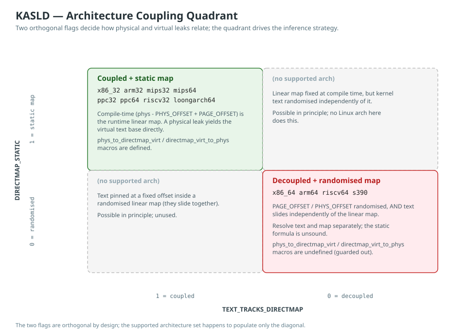
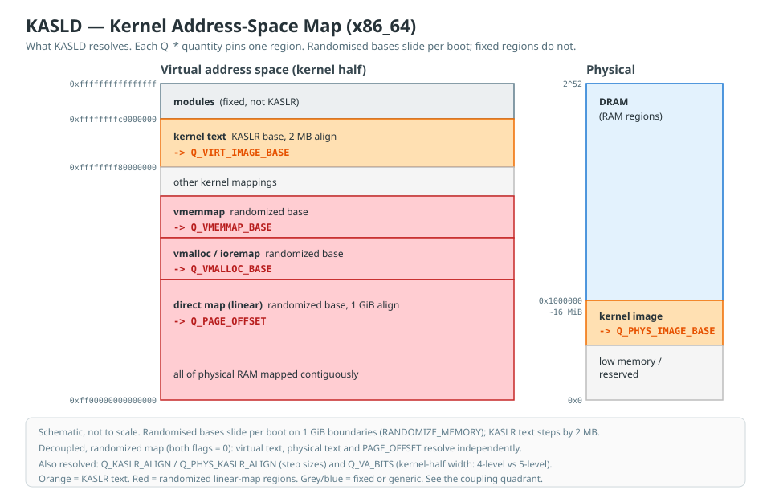

# KASLR and Kernel Memory Layout

Reference material on how Linux KASLR works, what it randomizes, and how
the kernel virtual address space is laid out across architectures.

## Table of Contents

- [Linux KASLR history and implementation](#linux-kaslr-history-and-implementation)
  - [Default text base and KASLR alignment](#default-text-base-and-kaslr-alignment)
  - [x86 slot granularity (CONFIG_PHYSICAL_ALIGN)](#x86-slot-granularity-config_physical_align)
  - [KASLR runtime states](#kaslr-runtime-states)
- [Physical and virtual KASLR](#physical-and-virtual-kaslr)
- [Kernel sections](#kernel-sections)
- [Virtual memory split (vmsplit)](#virtual-memory-split-vmsplit)
- [Function Granular KASLR (FG-KASLR)](#function-granular-kaslr-fg-kaslr)
- [Glossary](#glossary)

## Linux KASLR history and implementation

Not all architectures support KASLR (`CONFIG_RANDOMIZE_BASE`) or enable it by
default:

![Timeline of KASLR arriving upstream and later becoming the default. Each architecture is a horizontal line with two events on it. A pale amber segment starting at a hollow marker is the stretch where the support existed but a stock build still shipped it off; a green segment starting at a filled marker is where KASLR became the default. x86_32 and x86_64 gained it in v3.14 (2013) and turned it on in v4.12 (2017), a gap of three and a half years. arm64 gained it in v4.6 (2016) and was enabled in the upstream defconfig in v5.3 (2019). s390 is the only architecture with no amber segment at all: v5.2 (2019) both introduced KASLR and shipped it on. LoongArch gained it in v6.3 and was enabled in v6.6, six months later. Four architectures have never left the amber segment and still ship KASLR off: MIPS32 and MIPS64 since v4.7 (2016), PowerPC32 since v5.5 (2019), and RISC-V64 since v6.6 (2023). Seven architectures have no KASLR in mainline at all](diagrams/kaslr-adoption.svg)

| Architecture | KASLR Added | Date Added | Enabled by Default | Date Enabled | Notes |
|---|---|---|---|---|---|
| x86_32 | v3.14 ([`8ab3820fd5b2`](https://github.com/torvalds/linux/commit/8ab3820fd5b2)) | 2013-10-13 | v4.12 ([`6807c84652b0`](https://github.com/torvalds/linux/commit/6807c84652b0)) | 2017-04-18 | Kconfig `default y` |
| x86_64 | v3.14 ([`8ab3820fd5b2`](https://github.com/torvalds/linux/commit/8ab3820fd5b2)) | 2013-10-13 | v4.12 ([`6807c84652b0`](https://github.com/torvalds/linux/commit/6807c84652b0)) | 2017-04-18 | Kconfig `default y` |
| arm64 | v4.6 ([`f80fb3a3d508`](https://github.com/torvalds/linux/commit/f80fb3a3d508)) | 2016-02-24 | v5.3 ([`8049672bb17a`](https://github.com/torvalds/linux/commit/8049672bb17a)) | 2019-06-25 | Enabled in upstream arm64 defconfig |
| MIPS32 | v4.7 ([`405bc8fd12f5`](https://github.com/torvalds/linux/commit/405bc8fd12f5)) | 2016-05-13 | No | — | Max offset 128 MiB (limited by KSEG0) |
| MIPS64 | v4.7 ([`405bc8fd12f5`](https://github.com/torvalds/linux/commit/405bc8fd12f5)) | 2016-05-13 | No | — | Max offset 1 GiB |
| s390 | v5.2 ([`b2d24b97b2a9`](https://github.com/torvalds/linux/commit/b2d24b97b2a9)) | 2019-04-29 | v5.2 | 2019-04-29 | Kconfig `default y` from initial commit |
| PowerPC32 | v5.5 ([`2b0e86cc5de6`](https://github.com/torvalds/linux/commit/2b0e86cc5de6)) | 2019-11-13 | No | — | BookE/e500 (PPC_85xx) only |
| LoongArch | v6.3 ([`e5f02b51fa0c`](https://github.com/torvalds/linux/commit/e5f02b51fa0c)) | 2023-02-25 | v6.6 ([`671eae93ae20`](https://github.com/torvalds/linux/commit/671eae93ae20)) | 2023-09-07 | Enabled in upstream loongson3_defconfig |
| RISC-V64 | v6.6 ([`84fe419dc757`](https://github.com/torvalds/linux/commit/84fe419dc757)) | 2023-09-05 | No | — |  |
| arm32 | — | — | — | — | Not supported |
| PowerPC64 | — | — | — | — | Not supported |
| sparc | — | — | — | — | Not supported |
| SuperH (sh) | — | — | — | — | Not supported |
| m68k | — | — | — | — | Not supported |
| MicroBlaze | — | — | — | — | Not supported |
| OpenRISC | — | — | — | — | Not supported |

Even where KASLR is unsupported, disabled, or failed to randomize, the
kernel's load address may still vary across boots: a bootloader
(U-Boot, GRUB, the EFI stub, Coreboot, etc.) is free to place the image
at whatever physical address suits the board's memory map. The kernel
is not actively randomizing in that case, but the base is still unknown
to a local user a priori. KASLD treats this case identically —
the same inference engine narrows the bootloader-chosen base from
observable evidence (`dmesg` landmarks, `/proc/iomem`, `/sys` facts,
devicetree reservations) to a residual window, or to a single address
where the evidence allows. See [KASLR runtime states](#kaslr-runtime-states)
below for the distinction between *disabled* (kernel at the link-time
default), *unsupported* (arch has no KASLR machinery), and
*randomization failed* (boot stub tried but no random offset applied).

See also:

* [grsecurity - KASLR: An Exercise in Cargo Cult Security](https://grsecurity.net/kaslr_an_exercise_in_cargo_cult_security) (grsecurity, 2013)
* [An Info-Leak Resistant Kernel Randomization for Virtualized Systems | IEEE Journals & Magazine | IEEE Xplore](https://ieeexplore.ieee.org/document/9178757) (Fernando Vano-Garcia, Hector Marco-Gisbert, 2020)
* Kernel Address Space Layout Randomization (LWN.net)
  * [Kernel address space layout randomization [LWN.net]](https://lwn.net/Articles/569635/)
  * [Randomize kernel base address on boot [LWN.net]](https://lwn.net/Articles/444556/)
  * [arm64: implement support for KASLR [LWN.net]](https://lwn.net/Articles/673598/)
* [Kernel load address randomization · Linux Inside](https://0xax.gitbooks.io/linux-insides/content/Booting/linux-bootstrap-6.html)
* KASLR Kconfig options:
  * [CONFIG_RANDOMIZE_BASE: Randomize the address of the kernel image (KASLR)](https://cateee.net/lkddb/web-lkddb/RANDOMIZE_BASE.html)
  * [CONFIG_RANDOMIZE_BASE_MAX_OFFSET: Maximum kASLR offset](https://cateee.net/lkddb/web-lkddb/RANDOMIZE_BASE_MAX_OFFSET.html)
  * [CONFIG_RANDOMIZE_MEMORY: Randomize the kernel memory sections](https://cateee.net/lkddb/web-lkddb/RANDOMIZE_MEMORY.html)
  * [CONFIG_RANDOMIZE_MEMORY_PHYSICAL_PADDING: Physical memory mapping padding](https://cateee.net/lkddb/web-lkddb/RANDOMIZE_MEMORY_PHYSICAL_PADDING.html)
  * [CONFIG_RELOCATABLE: Build a relocatable kernel](https://cateee.net/lkddb/web-lkddb/RELOCATABLE.html)

### Default text base and KASLR alignment

When KASLR is disabled, the kernel loads at a fixed virtual address — the
"default text base." This address is determined by the architecture's linker
script, Kconfig options, or hardware memory map. When KASLR is enabled, the
kernel is placed at `default + N × grain`, where N is chosen randomly within the
architecture's valid range and `grain` is the spacing its placement code steps
by: each possible position is one "KASLR slot." That spacing is at least the
alignment the architecture guarantees for `_text` and can be coarser, so the
table below states the two separately.

The table is the kernel's compile-time default — the address the image
lands at when no relocation occurs. On relocating architectures (every
supported arch except PowerPC64 and SPARC) the bootloader chooses the
load address from the board's memory map. The table is the baseline
against which the KASLR slide is measured, not the load address on every
system.

The "default text base" here is the **image base** (`_text`) — the start of
the kernel image, which is what KASLR aligns and what KASLD reports. The
familiar `_stext` (start of the code section) sits a fixed *head gap* above
`_text`: zero on most architectures (so `_text == _stext`), but non-zero where
a header precedes the code (arm64's `.head.text`, `0x10000`). KASLD solves the
image base and shows `_stext` as a derived line only when the two differ; a
leaked `_stext` (e.g. from `/proc/kallsyms`) is normalized back to the image
base when it is consumed, so the slide is always measured against `_text`.

| Architecture | Default text base | Derivation | Min alignment | Grain | KASLR slots | Entropy |
|---|---|---|---|---|---|---|
| x86_64 | `0xffffffff81000000` | `__START_KERNEL_map` + `PHYSICAL_START` (`page_64_types.h`) | 2 MiB | 2 MiB⁶ | 504² | ~9 bits |
| x86_32 | `0xc0000000` | `PAGE_OFFSET` (3G/1G vmsplit default) | 8 KiB | 2 MiB⁶ | 248² | ~8 bits |
| arm64 | `0xffff800080000000`³ | `KIMAGE_VADDR` = `_PAGE_END(VA_BITS_MIN)` + module-region size (`memory.h`) | 64 KiB | 64 KiB⁴ | ~1073M | ~30 bits |
| arm32 | `0xc0008000` | `PAGE_OFFSET` + `TEXT_OFFSET` (`0x8000`, from `arch/arm/Makefile`) | 32 KiB | — | — | No KASLR |
| MIPS32 | `0x80100000` | KSEG0 (`0x80000000`) + 1 MiB load offset; `_text` is the linker load address, so the head gap in `head.S` (`0x400`) separates `_stext`, not `_text` | 64 KiB | 64 KiB | varies | varies |
| MIPS64 | `0xffffffff80100000` | CKSEG0 (`0xffffffff80000000`) + 1 MiB load offset; `_stext` sits `0x400` above it, as on MIPS32 | 64 KiB | 64 KiB | varies | varies |
| s390 | `0x3FFE0100000` | `CONFIG_KERNEL_IMAGE_BASE` + `TEXT_OFFSET` (1 MiB) | 16 KiB | 16 KiB⁵ | varies⁵ | ≥17 bits⁵ |
| PowerPC32 | `0xc0000000` | `PAGE_OFFSET` (3G/1G default); BookE only | 4 KiB | 16 KiB¹ | varies | varies |
| PowerPC64 | `0xc000000000000000` | `PAGE_OFFSET` (Kconfig) | 16 KiB | — | — | No KASLR |
| LoongArch | `0x9000000000200000` | DMW1 (`0x9000000000000000`) + `TEXT_OFFSET` (2 MiB, from `Makefile`) | 64 KiB | 64 KiB | varies | varies |
| RISC-V64 | `0xffffffff80002000` | `KERNEL_LINK_ADDR` (top 2 GiB of VA) + `TEXT_OFFSET` (`0x2000`, `.head.text`) | 2 MiB | 2 MiB | 512² | ~9 bits |
| RISC-V32 | `0xc0002000` | `PAGE_OFFSET` + `TEXT_OFFSET` (`0x2000`) | 4 MiB | — | — | No KASLR |

The "Derivation" column shows where each default address comes from. On
most architectures the formula is `PAGE_OFFSET + TEXT_OFFSET`, where
`PAGE_OFFSET` is the start of the kernel virtual address space (set by
hardware mapping or Kconfig) and `TEXT_OFFSET` is the offset from the
mapping base to the `.text` section entry point (set by the linker script
or boot protocol). x86_64 is an exception: the kernel image virtual base
(`__START_KERNEL_map = 0xffffffff80000000`) is separate from `PAGE_OFFSET`
(the direct-map base), and `PHYSICAL_START` (16 MiB) is added for
alignment with the physical load address.

`Min alignment` is the alignment `_text` is guaranteed to have — the finest
grid the architecture's placement code can be asked to use, and the value
KASLD carries as its compile-time baseline. `Grain` is the spacing KASLR
actually steps by, and is what the `KASLR slots` and `Entropy` columns are
computed from. The two diverge wherever a build option or the randomization
code itself chooses a grid coarser than the architecture requires. On the
three architectures with no KASLR the minimum is still a real load alignment,
while `Grain` reads `—` because there are no slots to space.

¹ BookE KASLR steps the text base on a 16 KiB grid
(`arch/powerpc/mm/nohash/kaslr_booke.c`), but the `CONFIG_RELOCATABLE` it
depends on states of PowerPC32 that "there is no any alignment restrictions"
(`arch/powerpc/Kconfig`): a relocatable kernel runs from wherever the boot
loader placed it, at any alignment. Only the page is guaranteed, so a base away
from the compile-time default is evidence of relocation rather than of
randomization.

² The slot count is an upper bound. Every architecture's KASLR placement
code refuses positions where the image would extend past the end of the
randomization region, so the actual available slots are:

```
valid_slots = (range_size - kernel_size) / slot_grain
```

`kernel_size` is measured differently per architecture. On x86
(`arch/x86/boot/compressed/kaslr.c`), it is `init_size` from the boot
header — the decompression buffer requirement, which is larger than the
final loaded kernel size. On RISC-V (`arch/riscv/mm/init.c`), it is
`_end − _start` — the actual in-memory kernel size with no overhead.
On x86, `MODULES_VADDR` is defined as `__START_KERNEL_map +
KERNEL_IMAGE_SIZE` with no gap, so the ceiling is hard. (KASLD's `Search
space` readout counts a closed range and so reports one more slot than this
column — e.g. `505` on x86_64 where the table shows `504`.)

³ The arm64 row is the `VA_BITS_MIN = 48` case (4K/16K 4-level, plus 52-bit LVA)
— the common one. Sub-48 configs place the image higher and randomize over a
smaller window, since `KIMAGE_VADDR = _PAGE_END(VA_BITS_MIN) + module-region
size` and `_PAGE_END = -(1 << (VA_BITS_MIN − 1))`: 4K 3-level (`VA_BITS = 39`,
common on Android) → `0xffffffc080000000`, 64K 2-level (42), 16K 3-level (47),
and 16K 2-level (36, `EXPERT`-gated).
KASLD detects the running `VA_BITS` with an mmap boundary probe
(`mmap_arm64_va_bits`) and resolves the per-config text band and entropy
accordingly.

⁴ The arm64 text base is aligned to `EFI_KIMG_ALIGN` (64 KiB on 4K/16K pages,
128 KiB on 64K pages), NOT the 2 MiB seed step. Under KASLR the EFI stub loads
the image at 64 KiB alignment (weaker than the 2 MiB boot protocol), and the
kernel grafts the low 2 MiB bits of that physical address into the virtual
KASLR displacement so text can still be mapped with 2 MiB blocks. The result is
a virtual text base that steps by 64 KiB, not 2 MiB, so 64 KiB is the alignment
of `_text` (the slot count divides the window by 64 KiB). The 2 MiB seed step
governs only the high bits of the displacement.

⁵ s390 has no fixed slot count. `arch/s390/boot/startup.c` randomizes over
`kaslr_len = max(KASLR_LEN, vmax - vsize)` — the larger of a 2 GiB floor
(`KASLR_LEN`, `pgtable.h`) and whatever virtual space is left above the
identity map, vmemmap and vmalloc areas. The ceiling is the address-space
limit: `_REGION2_SIZE` (4 TiB) on the 3-level path, `_REGION1_SIZE` (8 PiB) on
4-level. 131K slots / 17 bits is therefore the guaranteed minimum rather than
the maximum, and it is reached only when that leftover space is smaller than
the floor; an ordinary guest randomizes over a range nearer 4 TiB, on the order
of 268M slots (~28 bits). The slot granularity is `THREAD_SIZE` — 16 KiB normally, 64 KiB
under `CONFIG_KASAN` or `CONFIG_KMSAN`, which raise `THREAD_SIZE_ORDER`.
Virtual and physical KASLR were uncoupled on s390 in v6.10; before that the
virtual base tracked the physical one, over a much narrower range.

⁶ x86 is the one architecture whose grain is a build option rather than a
constant: `CONFIG_PHYSICAL_ALIGN` ranges from the architectural minimum up to
16 MiB on both targets, and the slot and entropy columns assume its 2 MiB
default. Distro kernels do raise it. See
[x86 slot granularity (CONFIG_PHYSICAL_ALIGN)](#x86-slot-granularity-config_physical_align).

| Architecture | Max slots | Approx. `kernel_size` | Typical runtime slots | Reduction |
|---|---|---|---|---|
| x86_64 | 504 | `init_size` ≈ 70 MiB | ~469 | ~7% |
| x86_32 | 248 | `init_size` ≈ 40 MiB | ~228 | ~8% |
| RISC-V64 | 512 | `_end−_start` ≈ 30 MiB | ~497 | ~3% |
| s390 | ≥131K⁵ | ≈ 70 MiB | ≥127K | ≤3% |
| arm64 | ~1073M | ≈ 50 MiB | ~1073M | <0.01% |

On x86 and RISC-V, where the whole budget is 248 to 512 slots (~8 to ~9 bits),
a 3–8% reduction is material. On s390 (≥17 bits) and arm64 (~30 bits) the
effect is negligible.

### x86 slot granularity (CONFIG_PHYSICAL_ALIGN)

The `Min alignment` column above is exactly that — the finest grid the
placement code can be asked to use. On x86 the build chooses the value it
actually uses, from a Kconfig range that starts at that minimum:

```
config PHYSICAL_ALIGN
	default "0x200000"
	range 0x2000 0x1000000 if X86_32
	range 0x200000 0x1000000 if X86_64
```

A coarser choice does not move the randomization window, it thins it: the
window's endpoints are unchanged and the candidates inside it step further
apart, so the slot count falls in proportion and the entropy with it. At the
16 MiB ceiling an x86_64 kernel has 64 image-base slots rather than 505 — 6 bits
instead of ~9.

That ceiling is not hypothetical. Alpine builds its x86_64 kernels at 16 MiB,
where Debian, Ubuntu and Android all use the 2 MiB default; on x86_32 both
distro kernels in the fixture corpus use 16 MiB. Two captures, both x86_64, both
with KASLR on:

<!-- checked: capture alignment x86_64 (tests/check-doc-alignment) -->

| Capture | `kernel_alignment` | Image-base slots | Entropy |
|---|---|---|---|
| `alpine-3.21-6.12.81-0-virt` | 16 MiB | 64 | 6 bits |
| `debian-13-6.12.94_deb13-amd64` | 2 MiB | 505 | ~9 bits |

Either is reproducible from the corpus:

```
extra/prepare-bundle tests/fixtures/x86_64/alpine-3.21-6.12.81-0-virt /tmp/r
KASLD_SYSROOT=/tmp/r kasld -q
```

So the per-architecture entropy in the table above describes a default build
rather than every kernel in the field, and on x86 the difference between the two
reaches 3 bits.

The value is readable at run time, which is why it need not be assumed: x86
records it in the setup header as `kernel_alignment`, exposed by the kernel at
`/sys/kernel/boot_params/data` and present in the `/boot` image the header was
copied from. A run that reads it reports an exact `Grain`; a run that cannot
falls back to the architectural minimum and prefixes the column `>=`, since an
unread value can only be coarser and the candidate count beside it is therefore
a ceiling. See the `Grain` column in [Usage](usage.md).

### KASLR runtime states

A KASLR-capable architecture can be in one of four runtime states on
any given boot. The states have different exploitation implications
and KASLD reports them distinctly:

| State | Where the kernel landed | Slot entropy | Bootloader entropy |
|---|---|---|---|
| **Active** | One of `valid_slots` positions chosen uniformly | Full (`log2(valid_slots)`) | Subsumed by KASLR — placement is randomized within the bootloader-determined range |
| **Disabled** | The arch's compile-time default text base, exactly | 0 bits — fully predictable | None — opt-out is honoured before the bootloader chooses |
| **Unsupported** | Bootloader-determined physical address; virtual address is hardware-fixed (e.g. `PAGE_OFFSET + TEXT_OFFSET` on arm32) | 0 bits — arch has no KASLR machinery | Whatever entropy the bootloader's placement policy provides — often per-boot deterministic |
| **Randomization failed** | Boot-stub- or firmware-deterministic, *not* the link-time default | 0 bits — boot stub skipped the random offset | Whatever entropy the deterministic fallback path provides — typically the lowest aligned slot the firmware allocator returns, identical across boots on the same hardware |

The path a boot takes to each state — and the load-bearing *disabled* vs
*randomization failed* distinction — at a glance:


The four states are entered by different mechanisms:

- **Active** — the default for any KASLR-supporting arch when the
  entropy source is available and not opted out.

- **Disabled** is reached by an explicit opt-out:
  - `nokaslr` on the kernel cmdline (every KASLR-supporting arch).
  - `CONFIG_RANDOMIZE_BASE=n` at build time.
  - Hibernation resume on x86 (the kernel must land at the same
    address as the snapshot, so KASLR is forced off — see
    `arch/x86/boot/compressed/kaslr.c`).
  - The `kexec_file` token on LoongArch (kernel loaded by
    `kexec_file_load(2)` honours the loader's chosen address).
  - The `elfcorehdr=` kdump handoff path on s390 (the panic kernel
    must land at a known address).
  - FDT without `/chosen/kaslr-seed` on riscv64 non-EFI boot (the
    kernel falls back to the link-time default; the EFI path goes
    through the *randomization failed* state instead).

- **Unsupported** applies to architectures where the kernel build
  has no KASLR machinery: arm32, PowerPC64, RISC-V32, SPARC.

- **Randomization failed** applies when the KASLR machinery ran but
  could not produce a random offset:
  - arm64 EFI stub: no `EFI_RNG_PROTOCOL`, no FDT `kaslr-seed`
    (dmesg: `KASLR disabled due to lack of seed`).
  - arm64: FDT remap failure during early init
    (dmesg: `KASLR disabled due to FDT remapping failure`).
  - s390 boot stub: CPU has no PRNG instruction
    (dmesg: `KASLR disabled: CPU has no PRNG`).
  - s390 boot stub: not enough memory to relocate
    (dmesg: `KASLR disabled: not enough memory`).
  - riscv64 EFI stub: the same shape as arm64 (`EFI_RNG_PROTOCOL`
    falls back to a deterministic firmware-allocated position when
    no random source is exposed). The riscv64 no-seed dmesg signal
    is not always emitted by the kernel; whether the engine enters
    the *randomization failed* or *disabled* state depends on which
    indicator the components observe.

The dmesg line in the third state begins with the same `KASLR
disabled` prefix as a deliberate opt-out — distinguishing them
requires inspecting the reason text. The kernel is still relocated by
the boot stub but lands at a firmware-determined position rather than
the link-time default, so consumers MUST NOT treat this signal as a
pin-to-default. KASLD emits a distinct scalar fact
(`SF_VIRT_KASLR_RANDOMIZATION_FAILED` + `SF_PHYS_KASLR_RANDOMIZATION_FAILED` versus `SF_VIRT_KASLR_DISABLED` +
`SF_PHYS_KASLR_DISABLED`) and neither sets the summary's
`kaslr.disabled` flag nor pins `Q_VIRT_IMAGE_BASE` or `Q_PHYS_IMAGE_BASE`
from this signal.

Per-host fingerprintability: in the *randomization failed* state, the
position is deterministic per (firmware, kernel build, hardware)
tuple. An operator who has previously captured ground truth on the
same machine can re-use the slide on subsequent boots without
re-leaking — a substantively different security posture from active
KASLR where each boot is independent.

## Physical and virtual KASLR

Linux KASLR randomizes the kernel location in both physical memory (where the
kernel image resides in RAM) and virtual memory (where the kernel is mapped in
the address space). Depending on the architecture, these may be randomized
together using a single offset (coupled) or independently using separate offsets
(decoupled).

On architectures where physical and virtual randomization are coupled (i.e.
the same offset), leaking either a physical or virtual kernel address
trivially reveals the other. On architectures where they are decoupled,
a physical address leak does not directly reveal the virtual address
(and vice versa), providing stronger isolation.

| Architecture | Phys/Virt Relationship | Since | Notes |
|---|---|---|---|
| x86_32 | Coupled | v3.14 | Virtual offset equals physical offset |
| arm64 | Decoupled | v4.6 | EFI stub randomizes physical; `kaslr_early_init` randomizes virtual; linear map has limited entropy |
| MIPS32/64 | Coupled | v4.7 | Single relocation offset; fixed kseg0 virt-to-phys mapping |
| x86_64 | Decoupled | v4.8 | Separate `find_random_phys_addr` / `find_random_virt_addr`; also `CONFIG_RANDOMIZE_MEMORY` for memory sections |
| s390 | Decoupled | v5.2 | Identity-mapped (virt = phys) through v6.7; v6.8+ moves kernel text to a separate high mapping randomized as normal KASLR, so KASLD models it decoupled (`TEXT_TRACKS_DIRECTMAP=0`); the identity/direct-map base can also be randomized via `RANDOMIZE_IDENTITY_BASE`, a debug-oriented option off by default (pinned to 0 on production kernels) |
| PowerPC32 | Coupled | v5.5 | Same offset applied to both addresses |
| LoongArch | Coupled | v6.3 | Single relocation offset; direct-mapped windows |
| RISC-V64 | Virtual only | v6.6 | Only virtual address randomized; physical depends on bootloader |

KASLD models this relationship with two orthogonal per-architecture flags —
`TEXT_TRACKS_DIRECTMAP` (does kernel text slide with the linear map?) and
`DIRECTMAP_STATIC` (is the compile-time direct-map projection sound at runtime?).
The quadrant they form decides the inference strategy, and every supported
architecture sits on its diagonal:



See also:

* [security things in Linux v4.8](https://outflux.net/blog/archives/2016/10/04/security-things-in-linux-v4-8/) (Kees Cook, 2016) — describes x86_64 physical/virtual decoupling and `CONFIG_RANDOMIZE_MEMORY`
* [x86, boot: KASLR memory randomization [LWN.net]](https://lwn.net/Articles/687353/) (Thomas Garnier, 2016) — `CONFIG_RANDOMIZE_MEMORY` patch series
* [Kernel load address randomization · Linux Inside](https://0xax.gitbooks.io/linux-insides/content/Booting/linux-bootstrap-6.html) — detailed walkthrough of `choose_random_location()` on x86

## Kernel sections

The kernel virtual address space contains distinct sections (text, modules,
direct map, etc.) mapped at different address ranges. KASLR randomizes the
kernel text base address, but not all sections are randomized together —
depending on the architecture, other sections may be at fixed addresses,
use the same KASLR offset, or be randomized independently.

The map below shows the x86_64 virtual and physical address spaces, with the
KASLD quantity (`Q_*`) that resolves each region annotated alongside it:



| Architecture | Text ↔ Phys | Text ↔ Direct map | Text ↔ Modules | Notes |
|---|---|---|---|---|
| x86_64 | Independent | Independent | Independent | Three separate randomizations (`CONFIG_RANDOMIZE_MEMORY`) |
| x86_32 | Coupled | Coupled | Tracks lowmem, not text | Single KASLR offset; the module region starts at `VMALLOC_START`, which is `PAGE_OFFSET` plus the runtime lowmem size plus 8 MiB |
| arm64 | Independent | Independent | Bracketed (within 2 GiB of text) | Separate phys/virt randomization; modules drawn from a window spanning the kernel image, so they move with it |
| arm32 | — | Coupled | Below PAGE_OFFSET, spills to vmalloc | No KASLR; a dedicated 16 MiB window below `PAGE_OFFSET`, with `CONFIG_ARM_MODULE_PLTS` (default y) spilling overflow into vmalloc above it |
| MIPS32/64 | Coupled | Coupled (kseg0) | Fixed module region | Hardware-defined mapping |
| PowerPC32 | Coupled | Coupled | Platform-dependent | A dedicated window below `PAGE_OFFSET` on 8xx / book3s32; every other platform, 85xx included, allocates from the shared vmalloc window |
| PowerPC64 | — | Coupled | Shared VAS | No KASLR |
| LoongArch64 | Coupled | Coupled | Fixed module region | Direct-mapped windows |
| RISC-V64 | Virtual only | Decoupled | Coupled (shifts with kernel) | Module region anchored to kernel `_end`; text ↔ directmap coupled on legacy pre-v5.10 kernels (no KASLR) |
| RISC-V32 | — | Coupled | Below PAGE_OFFSET (vmalloc) | No KASLR; modules share the vmalloc window, which on sv32 is the 512 MiB below `PAGE_OFFSET` |

On coupled architectures, all sections are at fixed offsets from each other:
a physical address reveals the virtual text base via
`phys_to_directmap_virt()`, the direct map is at a known offset
(`TEXT_OFFSET`) from the text base, and
modules are either at a fixed address or a constant offset from `PAGE_OFFSET`.
A single leak from any section is sufficient to derive the others. On
decoupled architectures like x86_64, each section is randomized independently
— a physical address reveals nothing about the virtual text base, and the
direct map base (`virt_page_offset`) is randomized separately.

RISC-V64 is notable: the module region is anchored to the kernel image
(`MODULES_VADDR = PFN_ALIGN(&_end) - SZ_2G`, `MODULES_END = PFN_ALIGN(&_start)`),
so modules shift with the randomized kernel rather than occupying a fixed
region. See
[architecture.md → Cross-region derivation](architecture.md#cross-region-derivation)
for how KASLD exploits this.

## Virtual memory split (vmsplit)

On 32-bit systems, the 4 GiB virtual address space is divided between
userspace and the kernel. The boundary — `PAGE_OFFSET` (also known as
the "vmsplit") — determines where the kernel virtual address space begins.

The most common configuration is a 3G/1G split (`PAGE_OFFSET=0xC0000000`),
but embedded systems and custom kernels may use different splits:

| Split | `PAGE_OFFSET` | User / Kernel | Notes |
|---|---|---|---|
| 1G/3G | `0x40000000` | 1 GiB / 3 GiB | Rare |
| 2G(opt)/2G | `0x78000000` | ~1.9 GiB / ~2.1 GiB | x86_32 only |
| 2G/2G | `0x80000000` | 2 GiB / 2 GiB | Common on embedded ARM |
| 3G(opt)/1G | `0xB0000000` | ~2.75 GiB / ~1.25 GiB | x86_32 only |
| 3G/1G | `0xC0000000` | 3 GiB / 1 GiB | Default for most distros |

The same five splits drawn to scale:


The vmsplit affects nearly all kernel virtual address boundaries: the kernel
text base, direct map, and (on some architectures) the module region all
shift with `PAGE_OFFSET`. This means KASLR analysis, address validation,
and memory layout interpretation depend on knowing the correct vmsplit.

Since KASLD is typically compiled on one system and deployed to another,
the compile-time `PAGE_OFFSET` assumption may not match the target system.
KASLD handles this at runtime: components that detect the actual `PAGE_OFFSET`
(e.g. `mmap_brute_vmsplit`, `boot_config`) emit a `pageoffset` tagged result,
and the orchestrator automatically adjusts all layout boundaries before
performing validation and analysis.

| Architecture | Configurable vmsplit | Config option | Default |
|---|---|---|---|
| x86_32 | Yes | `CONFIG_VMSPLIT_*` | `0xC0000000` (3G/1G) |
| arm32 | Yes | `CONFIG_PAGE_OFFSET` / `CONFIG_VMSPLIT_*` | `0xC0000000` (3G/1G) |
| PowerPC32 | Yes | `CONFIG_PAGE_OFFSET` | `0xC0000000` (3G/1G) |
| x86_64 | No | — | `0xFF00000000000000` (5-level) / `0xFFFF800000000000` (4-level) |
| arm64 | No | — | `0xFFF0000000000000` (52-bit VA) |
| MIPS32 | No | — | `0x80000000` (hardware kseg0) |
| MIPS64 | No | — | `0xFFFFFFFF80000000` (xkseg) |
| PowerPC64 | No | — | `0xC000000000000000` |
| LoongArch64 | No | — | `0x9000000000000000` |
| RISC-V32 | No | — | `0xC0000000` |
| RISC-V64 | No | — | `0xFF60000000000000` (SV57) |

See also:

* [0xAX/linux-insides](https://github.com/0xAX/linux-insides)
  * https://github.com/0xAX/linux-insides/tree/master/Initialization
  * https://github.com/0xAX/linux-insides/blob/master/Theory/linux-theory-1.md
  * https://github.com/0xAX/linux-insides/tree/master/MM
* [Virtual Memory and Linux](https://elinux.org/images/b/b0/Introduction_to_Memory_Management_in_Linux.pdf) (Matt Porter, 2016)
* [Understanding the Linux Virtual Memory Manager](https://www.kernel.org/doc/gorman/html/understand/index.html) (Mel Gorman, 2004)
* Linux Kernel Programming (Kaiwan N Billimoria, 2021)

## Function Granular KASLR (FG-KASLR)

Function Granular KASLR (aka "finer-grained KASLR") patches for the 5.5.0-rc7
kernel were [proposed in February 2020](https://lwn.net/Articles/811685/) but
**have not been merged as of 2026**.

This optional non-mainline mitigation ["rearranges your kernel code at load time on a per-function level granularity"](https://lwn.net/Articles/811685/)
and can be enabled with the [CONFIG_FG_KASLR](https://patchwork.kernel.org/project/linux-hardening/patch/20211223002209.1092165-8-alexandr.lobakin@intel.com/) flag.

FG-KASLR ensures the location of kernel and module functions are independently
randomized and no longer located at a constant offset from the kernel `.text`
base.

On systems which support FG-KASLR patches (x86_64 from 2020, arm64 from 2023),
this makes calculating offsets to useful functions more difficult and renders
kernel pointer leaks significantly less useful.

However, some regions of the kernel are not randomized (such as symbols before
`__startup_secondary_64` on x86_64) and offsets remain consistent across reboots.
Additionally, FG-KASLR randomizes only kernel functions, leaving other useful
kernel data (such as [modprobe_path](https://sam4k.com/like-techniques-modprobe_path/)
and `core_pattern` usermode helpers) unchanged at a static offset.

As of January 2026, a prerequisite for landing FG-KASLR on x86 is under
discussion: a [proposal to link the relocatable x86_64 kernel as a
PIE](https://lore.kernel.org/lkml/20260108092526.28586-21-ardb@kernel.org/)
(Ard Biesheuvel). Earlier x86 FG-KASLR attempts were tied to the x86-specific
kernel relocation format; recasting the kernel as an ordinary
position-independent ELF would let FG-KASLR be implemented in the ELF domain and
carry to other architectures (arm64, RISC-V, LoongArch) rather than staying
x86-only. PIE linking by itself randomizes only the kernel base — every symbol
keeps a fixed offset from `.text` — so it is a foundation for FG-KASLR, not
FG-KASLR itself; the per-function reordering is a separate step layered on top.

KASLD does not defeat FG-KASLR, but it can detect when the kernel text has been
reordered: [function_order_fingerprint.c](../src/components/function_order_fingerprint.c)
clusters `/proc/kallsyms` by symbol name order (not by address, so it survives
`kptr_restrict<=1`) and reports when the text no longer follows link order. This
covers the wider reordered-text class — LTO, AutoFDO, and Propeller builds — not
only `CONFIG_FG_KASLR`.

See also:

* [[RFC/RFT PATCH 00/19] Link the relocatable x86 kernel as PIE](https://lore.kernel.org/lkml/20260108092526.28586-21-ardb@kernel.org/) (Ard Biesheuvel, January 2026) — the PIE prerequisite for ELF-domain FG-KASLR
* [[PATCH v10 00/15] Function Granular KASLR](https://lore.kernel.org/lkml/20220209185752.1226407-1-alexandr.lobakin@intel.com/)
* [CONFIG_FG_KASLR](https://patchwork.kernel.org/project/linux-hardening/patch/20211223002209.1092165-8-alexandr.lobakin@intel.com/)
* [FGKASLR - CTF Wiki](https://ctf-wiki.org/pwn/linux/kernel-mode/defense/randomization/fgkaslr/)

## Glossary

KASLR and kernel-memory-layout terms used across the docs and in KASLD's output.
For KASLD's own engine and tool vocabulary (quantity, estimate, covering, rule,
…), see [architecture.md → Glossary](architecture.md#glossary).

- **slide** — the per-boot offset between the kernel's compile-time default base
  and where it actually loaded. The quantity KASLR randomizes; reported as
  `slide +0x…`. See [Default text base](#default-text-base-and-kaslr-alignment).
- **default text base** — the fixed virtual address the kernel image loads at when
  KASLR is disabled; the baseline the slide is measured against. See
  [Default text base](#default-text-base-and-kaslr-alignment).
- **image base (`_text`)** — the start of the kernel image: the address KASLR
  aligns and KASLD solves. `_stext` (code-section start) sits a fixed *head gap*
  above it, zero on most architectures. See
  [Default text base](#default-text-base-and-kaslr-alignment).
- **grain / KASLR slot** — the randomization granularity. The kernel lands
  at `default + N × grain`; each candidate position is one slot. The readout's
  `Grain` column carries it. It is at least `IMAGE_ALIGN`, the alignment the
  architecture guarantees for `_text`, and is coarser wherever a build option or
  the randomization code picks a wider grid. See
  [Default text base](#default-text-base-and-kaslr-alignment).
- **search space** — how many slots a quantity could still be in, given the
  evidence. The readout states it against the set the row narrows (`24 of 505`),
  which is the brute-force cost of that row. See
  [usage.md](usage.md#default-text-mode).
- **entropy** — the number of random bits in the placement, `log2(slots)`; the
  same fact as the search space, expressed as a logarithm, and shown as
  `~N bits` under `-v` and in the machine formats. See
  [Default text base](#default-text-base-and-kaslr-alignment).
- **runtime state** — which of four conditions a KASLR-capable boot is in
  (randomized, disabled, …). See [KASLR runtime states](#kaslr-runtime-states).
- **`PAGE_OFFSET`** — the start of the kernel virtual address space; on 32-bit, the
  user/kernel boundary (the vmsplit). See
  [vmsplit](#virtual-memory-split-vmsplit).
- **vmsplit** — the division of a 32-bit address space between userspace and
  kernel, set by `PAGE_OFFSET`. See [vmsplit](#virtual-memory-split-vmsplit).
- **directmap (direct / linear map)** — the contiguous 1:1 mapping of physical RAM
  into the kernel virtual address space. See [Kernel sections](#kernel-sections).
- **vmemmap** — the virtual region holding the `struct page` array. See
  [Kernel sections](#kernel-sections).
- **coupled / decoupled** — whether physical and virtual KASLR share one offset
  (coupled — either leak reveals the other) or use independent offsets
  (decoupled). KASLD names this with two per-arch flags; see
  [architecture.md → Glossary](architecture.md#glossary) and
  [Physical and virtual KASLR](#physical-and-virtual-kaslr).
- **FG-KASLR** — Function Granular KASLR: per-function reordering, so a single leak
  no longer implies a constant offset to other functions. See
  [FG-KASLR](#function-granular-kaslr-fg-kaslr).
